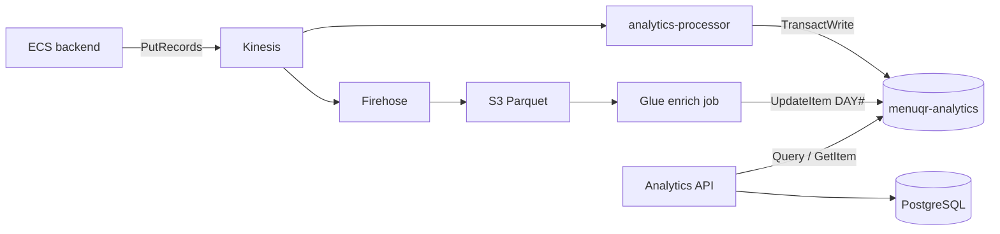

# DynamoDB Analytics — Diseño de datos y patrones de acceso

Documento de referencia para la tabla `menuqr-analytics`. Complementa [analytics-rediseno.md](./analytics-rediseno.md) §6.4 con el estado **implementado** en el repositorio.

---

## 1. Rol en la arquitectura

DynamoDB **no** almacena eventos crudos. Es la **capa de serving** para el dashboard admin: contadores pre-agregados que el SPA puede leer con `Query`/`GetItem` en tiempo real.

| Dato | Almacén | Quién escribe |
|------|---------|---------------|
| Eventos crudos | S3 (Parquet vía Firehose) | Kinesis → Firehose |
| Pedidos, ingresos, ticket | PostgreSQL (RDS) | Backend transaccional |
| Contadores realtime (vistas, carrito) | Dynamo `DAY#` / `HOUR#` / `ITEM#` | Lambda `analytics-processor` |
| Sesiones únicas, top ítems, breakdowns | Dynamo `DAY#` (campos batch) | Glue Job `analytics-enrich` |
| Ledger de idempotencia | Dynamo `PROC#` | Lambda `analytics-processor` |



**Principio:** lecturas acotadas por tenant (`PK = TENANT#{id}`). Sin `Scan`, sin GSI, sin eventos `EVENT#timestamp`.

---

## 2. Tabla física

| Propiedad | Valor |
|-----------|-------|
| Nombre | `menuqr-analytics` |
| Claves | `PK` (HASH), `SK` (RANGE) — ambas `String` |
| Billing | `PAY_PER_REQUEST` |
| TTL | Atributo `ttl` habilitado en ítems `PROC#` (7 d) y `HOUR#` (90 d) |
| GSI | Ninguno |

Definición Terraform: [`terraform/dynamo_analytics.tf`](../terraform/dynamo_analytics.tf).

---

## 3. Modelo lógico — tipos de ítem

Todos los ítems comparten `PK = TENANT#{tenantId}` (UUID del restaurante).

### 3.1 `DAY#{yyyy-MM-dd}` — agregado diario

Contadores del día y campos enriquecidos por batch.

| Atributo | Tipo | Hot path (Lambda) | Batch (Glue) | Descripción |
|----------|------|-------------------|--------------|-------------|
| `menuViews` | Number | `ADD +1` | — | Eventos `MENU_VIEW` |
| `itemViews` | Number | `ADD +1` | — | Eventos `ITEM_VIEW` |
| `sectionViews` | Number | `ADD +1` | — | Eventos `SECTION_VIEW` |
| `cartAdds` | Number | `ADD +1` | — | Eventos `CART_ITEM_ADDED` |
| `uniqueMenuSessions` | Number | — | `SET` | `COUNT(DISTINCT session_id)` filtrando `MENU_VIEW` |
| `topItemIds` | List\<String\> | — | `SET` | Top N `item_id` por `ITEM_VIEW` |
| `filterBreakdown` | Map\<String, Number\> | — | `SET` | Conteo por `filterTag` (`FILTER_APPLIED`) |
| `sectionBreakdown` | Map\<String, Number\> | — | `SET` | Conteo por `sectionId` (`SECTION_VIEW`) |
| `batchCompletedAt` | String (ISO-8601) | — | `SET` | Marca que el job nocturno materializó el día |

**Retención objetivo:** ~2 años (sin TTL automático en `DAY#` hoy; política de lifecycle a definir si el volumen crece).

### 3.2 `HOUR#{yyyy-MM-dd}T{HH}` — agregado horario

Mismos contadores que `DAY#` pero con granularidad de hora (zona del servidor Lambda / JVM al escribir).

| Atributo | Hot path |
|----------|----------|
| `menuViews`, `itemViews`, `sectionViews`, `cartAdds` | `ADD +1` según tipo de evento |
| `ttl` | `SET` epoch + 90 días (se renueva en cada evento de esa hora) |

**Uso:** heatmap de vistas, panel realtime (últimos 60 min).  
**Retención:** 90 días vía TTL (borrado automático eventual por DynamoDB).

### 3.3 `ITEM#{itemId}` — ranking por ítem

| Atributo | Operación |
|----------|-----------|
| `views` | `ADD +1` en cada `ITEM_VIEW` |
| `lastViewedAt` | `SET` al timestamp del evento |

**Uso:** top ítems más vistos, matriz mirado vs vendido (vistas desde Dynamo + ventas desde RDS).

### 3.4 `PROC#{eventId}` — ledger de idempotencia

| Atributo | Valor |
|----------|-------|
| `processedAt` | Timestamp del evento |
| `ttl` | Epoch + 7 días |

`Put` con `attribute_not_exists(SK)`. Si el `eventId` ya fue procesado, la transacción entera falla y el consumer hace **no-op** (ack sin duplicar contadores).

---

## 4. Escritura — hot path (Lambda processor)

**Código:** [`analytics-processor/processor_lambda.py`](../analytics-processor/processor_lambda.py)  
**Trigger:** Kinesis `menuqr-events` → `aws_lambda_event_source_mapping` con `ReportBatchItemFailures`.

### 4.1 Eventos que actualizan agregados

| `eventType` | Contadores tocados | Ítems en transacción |
|-------------|-------------------|----------------------|
| `MENU_VIEW` | `menuViews` en `DAY#` + `HOUR#` | `PROC#` + `DAY#` + `HOUR#` (3) |
| `ITEM_VIEW` | `itemViews` en `DAY#` + `HOUR#`; `views` en `ITEM#` | `PROC#` + `DAY#` + `HOUR#` + `ITEM#` (4) |
| `SECTION_VIEW` | `sectionViews` en `DAY#` + `HOUR#` | `PROC#` + `DAY#` + `HOUR#` (3) |
| `CART_ITEM_ADDED` | `cartAdds` en `DAY#` + `HOUR#` | `PROC#` + `DAY#` + `HOUR#` (3) |

### 4.2 Eventos que **no** escriben Dynamo

| `eventType` | Destino |
|-------------|---------|
| `FILTER_APPLIED`, `FILTER_CLEARED` | Solo S3; breakdown en Glue batch |
| `ORDER_SUBMITTED`, `ORDER_STATUS_CHANGED` | Solo S3 (+ pedido en RDS) |
| `CART_ITEM_REMOVED` | Solo S3 |

### 4.3 Transacción atómica

Cada evento elegible ejecuta un único `TransactWriteItems`:

```
1. Put    PROC#{eventId}     (condición: no existe)
2. Update DAY#{fecha}       (ADD contadores)
3. Update HOUR#{fecha+hora} (ADD contadores)
4. Update ITEM#{itemId}?    (solo ITEM_VIEW)
```

**Reintento Kinesis (at-least-once):** falla el `Put` en `PROC#` → `ConditionalCheckFailed` → se ignora el evento completo.

### 4.4 Dev local (sin Kinesis)

Con `ANALYTICS_KINESIS_ENABLED=false`, el backend usa [`DynamoAnalyticsAggregateRepository`](../backend/src/main/java/com/menudigital/infrastructure/dynamo/DynamoAnalyticsAggregateRepository.java) con la misma lógica de transacción. En ese modo `SECTION_VIEW` incrementa `itemViews` (proxy) en lugar de `sectionViews` — solo afecta desarrollo local.

---

## 5. Escritura — batch (Glue enrich)

**Código:** [`glue-jobs/glue_analytics_enrich.py`](../glue-jobs/glue_analytics_enrich.py)  
**Schedule:** cron `0 3 * * ?` UTC (diario).

Por cada `tenant_id` y fecha (ayer + hoy):

1. Lee Parquet en `s3://{bucket}/events/year=…/month=…/day=…/`
2. Dedup por `eventId` (`ROW_NUMBER` sobre partición)
3. Calcula métricas derivadas
4. `UpdateItem` en `DAY#{fecha}` con `SET` — **no modifica** contadores realtime (`menuViews`, etc.)

Campos escritos: `uniqueMenuSessions`, `topItemIds`, `filterBreakdown`, `sectionBreakdown`, `batchCompletedAt`.

---

## 6. Lectura — patrones de acceso

**Repositorio:** [`DynamoAnalyticsAggregateReadRepository`](../backend/src/main/java/com/menudigital/infrastructure/dynamo/DynamoAnalyticsAggregateReadRepository.java)

Todas las lecturas usan `PK = TENANT#{tenantId}`. Nunca `Scan`.

### 6.1 Operaciones base

| Operación | Expresión DynamoDB | Complejidad |
|-----------|-------------------|-------------|
| Día concreto | `GetItem` / `Query` con `SK = DAY#{date}` | O(1) |
| Rango de días | `Query` `SK BETWEEN DAY#{from} AND DAY#{to}~` | O(días) |
| Rango de horas | `Query` `SK BETWEEN HOUR#{from} AND HOUR#{to}~` | O(horas) |
| Todos los ítems | `Query` `begins_with(SK, 'ITEM#')` | O(ítems en carta) |

El sufijo `~` en el límite superior fuerza orden lexicográfico correcto dentro del prefijo `DAY#` / `HOUR#`.

### 6.2 Mapeo endpoint → Dynamo (+ RDS)

| Endpoint | Widget | Dynamo | RDS | Ítems leídos (típico) |
|----------|--------|--------|-----|------------------------|
| `GET /summary` | Vistas hoy/ayer | 2× `getDay` | pedidos, ingresos, ticket | 2 |
| `GET /summary` | Conversión | `getDay` (`uniqueMenuSessions`, `batchCompletedAt`) | `COUNT(DISTINCT session_id)` | 1 + SQL |
| `GET /menu` | Top vendidos | — | `topSoldItems` | SQL |
| `GET /menu` | Top vistos | `queryItems` + sort en API | — | ~50–150 |
| `GET /menu` | Matriz mirado/vendido | `queryItems` | ventas por ítem | ~50–150 + SQL |
| `GET /operations` | Heatmap vistas | `queryHours` (7 días) | — | ~168 |
| `GET /operations` | Heatmap pedidos | — | `ordersHeatmap` | SQL |
| `GET /realtime` | Últimos 60 min | `queryHours` | `orderBuckets` | ~12 + SQL |
| `GET /trends?days=N` | Serie histórica | `queryDays` (N días) | `dailyStats` | N + SQL |
| `GET /trends` | Filtros / secciones | campos batch en `DAY#` agregados | — | N |

**Conversión menú → pedido** (§5.4 de analytics-rediseno):

```
Numerador   = COUNT(DISTINCT orders.session_id)     -- RDS, siempre realtime
Denominador = DAY#.uniqueMenuSessions               -- Glue batch
Estado      = FINAL si batchCompletedAt indica materialización del día
```

### 6.3 Comparación con el diseño anterior

| Consulta | Esquema legacy (`menuqr-events`) | Esquema actual (`menuqr-analytics`) |
|----------|----------------------------------|-------------------------------------|
| Vistas 30 días | `Query` miles de `EVENT#…` | `Query` 30 ítems `DAY#…` |
| Top ítems | Scan / agregación en memoria | `Query` `ITEM#*` (~carta) |
| Heatmap | Releer todos los eventos | `Query` ~168 `HOUR#` |

---

## 7. Reglas de diseño

1. **No** guardar eventos crudos en Dynamo (`SK=EVENT#…` eliminado en Fase 5).
2. **No** usar `Scan` en producción.
3. **No** incrementar contadores sin pasar por `PROC#{eventId}` en la misma transacción.
4. **Máximo ~4 ítems** por transacción (`PROC#` + hasta 3 contadores).
5. **No** duplicar datos transaccionales de pedidos — viven en RDS.
6. **No** calcular `COUNT(DISTINCT)` en el hot path — lo hace Glue sobre S3.
7. **Toda lectura** acotada por `PK = TENANT#{id}`.
8. Nueva métrica: evaluar primero un campo más en `DAY#` (batch o mismo `UpdateItem`), no un SK nuevo por evento.

---

## 8. Particionado y escalabilidad

| Riesgo | Mitigación actual | Si escala |
|--------|-------------------|-----------|
| Hot partition en `PK = TENANT#{id}` | Aceptable para 30–100 restaurantes (lab/TP) | Sharding `TENANT#{id}#shard{n}` |
| Muchos ítems en carta | `queryItems` lineal en tamaño de menú | `DAY#.topItemIds` post-batch (ya implementado) |
| WCU en picos | PAY_PER_REQUEST + transacción compacta | Revisar shard Kinesis / batch size Lambda |

---

## 9. Recuperación ante fallos

| Escenario | Acción |
|-----------|--------|
| Lambda processor falla persistentemente | Mensajes a DLQ SQS (alarma SNS); **recuperar desde S3**, no replay ciego desde DLQ |
| Contadores desincronizados | Re-ejecutar Glue enrich sobre particiones S3 afectadas; `PROC#` evita doble conteo en reprocess |
| Pérdida de `DAY#` batch | Glue re-materializa `uniqueMenuSessions` desde Parquet |
| Fuente de verdad eventos | S3 data lake (Firehose) |

---

## 10. Referencias en código

| Componente | Archivo |
|----------|---------|
| Terraform tabla | `terraform/dynamo_analytics.tf` |
| Escritura hot path (prod) | `analytics-processor/processor_lambda.py` |
| Escritura hot path (dev) | `backend/.../DynamoAnalyticsAggregateRepository.java` |
| Lectura | `backend/.../DynamoAnalyticsAggregateReadRepository.java` |
| Batch enrich | `glue-jobs/glue_analytics_enrich.py` |
| Use cases API | `backend/.../application/analytics/GetAnalytics*.java` |
| Diseño completo | `docs/analytics-rediseno.md` §6.4 |
