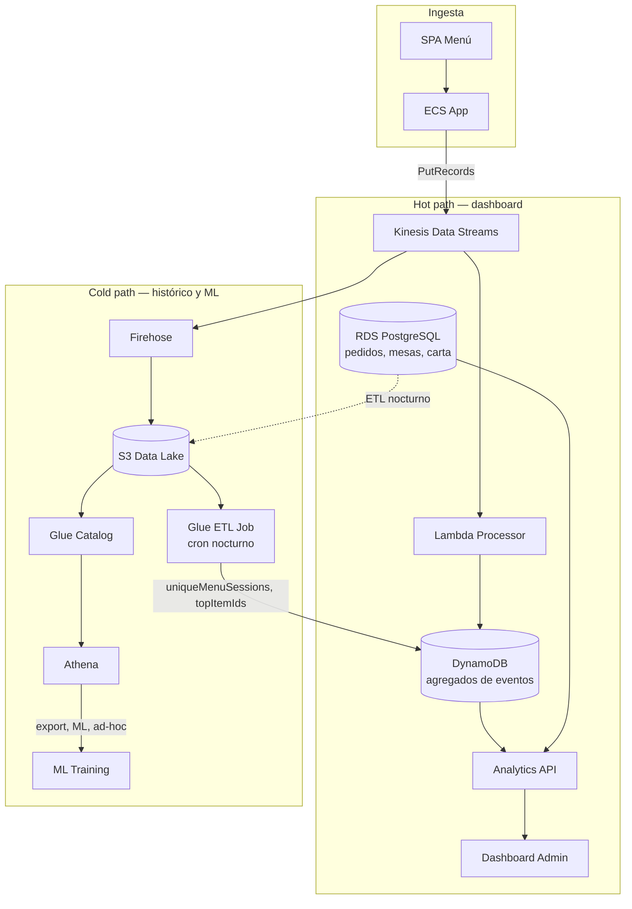

# MenuQR — Rediseño de Analytics y Pipeline de Datos

Documento de trabajo para repensar tableros, eventos y arquitectura de datos.  
Complementa [propuestas-mejoras.md](./propuestas-mejoras.md) y responde al feedback de [Corecciones.txt](./Corecciones.txt).

**Estado:** propuesta acordada — junio 2026  
**Alcance:** diseño target; implementación en fases (§8).

### 1.1 Arquitectura decidida

| Capa | Tecnología | Rol |
|------|------------|-----|
| **Ingesta** | Kinesis Data Streams | Bus de eventos; desacopla app del almacenamiento |
| **Histórico** | Firehose → S3 (Parquet) + Glue Catalog | Data lake; fuente de verdad de eventos |
| **Serving — pedidos** | **RDS** (PostgreSQL) | Pedidos, ingresos, ticket, top vendidos — ya es OLTP |
| **Serving — eventos** | **DynamoDB agregados** | Contadores `DAY` / `HOUR` / `ITEM` (máx 3 writes/evento) |
| **Analítica batch** | **Glue ETL Job** (materializar `DAY#`) | Sesiones únicas, top ítems, tendencias; cron nocturno |
| **Consulta ad-hoc** | **Athena** (opcional) | Export CSV, ML, investigación — no materializa `DAY#` |



**Tres velocidades:**

1. **Caliente** — Dynamo agregados + RDS pedidos → dashboard (< 300 ms).
2. **Tibia** — Glue ETL Job nocturno materializa `DAY#` (sesiones únicas, top ítems); Athena solo ad-hoc.
3. **Recuperación** — **S3** es fuente de verdad si Dynamo/Lambda fallan; replay vía Glue sobre el lake (§6.2.1, §6.3). La DLQ solo alerta e inspección.

**El dashboard nunca llama a Athena en tiempo real.**

**Qué NO hace Dynamo:** no guarda eventos crudos (S3). No duplica pedidos (RDS). Máximo **3 `UpdateItem` por evento**.

### 1.2 Correcciones de diseño (revisión técnica)

| # | Problema detectado | Resolución |
|---|-------------------|------------|
| 1 | 6–8 `UpdateItem` por evento | Presupuesto **≤3** (`DAY`, `HOUR`, `ITEM`) — §6.4.4 |
| 2 | Hot partition `TENANT#` / `DAY#` | Documentado; sharding si escala — §6.4.5 |
| 3 | `uniqueSessions (HLL)` sin base real | Eliminado del hot path; batch `COUNT DISTINCT` — §6.4.6 |
| 4 | Conversión sin correlación explícita | **`sessionId`** une RDS y eventos — §5.4 |
| 5 | Athena síncrono en `/trends` | Glue materializa; API lee `DAY#` — §6.4.6 |
| 6 | `counter++` sin idempotencia | **Ledger `PROC#{eventId}`** + `TransactWrite` — §6.4.8 |
| 7 | Sin DLQ en Lambda analytics | **SQS DLQ** para alertas; recuperación desde **S3** — §6.2.1 |
| 8 | Demasiado Redshift en el doc | **No usamos Redshift**; §6.5 condensado |
| 10 | `conversionRate` T-0 vs T-1 | Conversión del día **preliminar** hasta batch — §5.4.1 |
| 11 | Athena → Dynamo innecesario | **Glue Job** materializa `DAY#`; Athena solo ad-hoc — §6.5 |

## 1. Resumen ejecutivo

Hoy MenuQR registra eventos de interacción en **DynamoDB** y el dashboard admin **re-agrega 30 días de eventos crudos en cada request**. Las métricas actuales (vistas, heatmap, ranking de ítems) son útiles como señal de tráfico, pero **no responden preguntas de negocio** que un dueño de restaurante se hace todos los días:

- ¿Qué platos **venden** vs cuáles solo **miran**?
- ¿Cuántos comensales **llegan al pedido** después de ver el menú?
- ¿En qué **horarios** conviene tener más personal?
- ¿Qué **mesas** generan más actividad?
- ¿Mis **filtros dietéticos** realmente se usan y convierten?

La propuesta evoluciona hacia un **pipeline de datos en streaming** (Kinesis → S3 + Dynamo agregados + RDS) con tableros orientados al negocio y pipeline ML sobre el data lake.

---

## 2. Situación actual

### 2.1 Qué tenemos

| Capa | Implementación | Limitación |
|------|----------------|------------|
| Emisión | SPA menú → `POST /api/menu/{slug}/events` | Solo 4 tipos de evento |
| Persistencia | DynamoDB `menuqr-events` (`PK=TENANT#…`, `SK=EVENT#ts#id`) | Sin GSI, sin TTL, sin streams |
| Dashboard | Agregación en memoria (30 días) | Latencia y costo crecen con volumen |
| ML | Lambda worker lee `ITEM_VIEW` del día anterior | Solo popularidad; ignora pedidos y sesiones |
| Pedidos | RDS PostgreSQL | **No conectado** al dashboard analytics |

### 2.2 Eventos actuales

```
MENU_VIEW | ITEM_VIEW | SECTION_VIEW | FILTER_USED
```

### 2.3 Cobertura desigual

| Evento | Menú público | Mesa QR (flujo principal) |
|--------|--------------|---------------------------|
| `MENU_VIEW` | ✅ | ✅ (`metadata.source = TABLE_QR`) |
| `ITEM_VIEW` | ✅ | ❌ |
| `SECTION_VIEW` | ✅ | ❌ |
| `FILTER_USED` | ✅ | ❌ (sin filtros en mesa) |

El flujo que más importa al negocio — QR en mesa → pedido — genera **la menor señal analítica**.

### 2.4 Métricas del dashboard actual

- Vistas de menú (30d / hoy)
- Sesiones únicas y profundidad de sesión
- Gráfico diario menú vs ítems
- Heatmap hora × día
- Top 10 ítems + trending
- Uso de filtros dietéticos
- Engagement por sección
- Panel tiempo real (buckets 5 min)

**Calculadas pero no mostradas:** `peakHourOfDay`, `peakDayOfWeek`.

**Ausentes:** conversión, ingresos, pedidos, mesas, comparación menú público vs mesa.

---

## 3. Principios de diseño

1. **Pregunta de negocio primero, gráfico después.** Cada widget del dashboard debe responder una decisión concreta (carta, staffing, promociones).
2. **Un evento, muchos consumidores.** Kinesis → Lambda (Dynamo agregados) + Firehose (S3) + RDS (pedidos en OLTP).
3. **Unificar sesión.** Misma `sessionId` en menú, carrito y pedido para poder armar funnels.
4. **Eventos + transaccional.** Navegación en streaming; pedidos en RDS; correlación por **`sessionId`** (§5.4).
5. **Migración incremental.** Convivencia breve con Dynamo crudo → corte a agregados + Kinesis + S3.
6. **Dynamo solo como proyección materializada.** Access patterns diseñados para los gráficos (§6.4.1), nunca eventos crudos.
7. **Presupuesto de writes en Dynamo.** Máximo **3 contadores** por evento (`DAY`, `HOUR`, `ITEM`) + **1 ledger de idempotencia** — §6.4.4, §6.4.8.
8. **Costo consciente en Learner Lab.** Glue Job diario + Athena solo ad-hoc; sin Redshift 24/7.

---

## 4. Tableros propuestos

Reorganizar el admin en **cuatro vistas** en lugar de una página plana de gráficos de tráfico.

### 4.1 Vista «Resumen del día» (home)

Objetivo: *¿Cómo va el servicio hoy?*

| Widget | Métrica | Fuente | Decisión que habilita |
|--------|---------|--------|------------------------|
| Pedidos hoy | Conteo + vs ayer | **RDS** `orders` | Ritmo operativo |
| Ticket promedio | `sum(subtotal) / count(orders)` | **RDS** | Pricing y upsell |
| Conversión menú → pedido | `sessionId`: RDS pedidos / `DAY.uniqueMenuSessions` | **RDS** + **Dynamo** `DAY#` (§5.4) | Salud del funnel |
| Mesas activas | mesas con sesión en últimas 2h | **RDS** `table_sessions` | Ocupación |
| Pico de demanda | hora con más pedidos hoy | **RDS** | Turnos de cocina/mozo |
| Vistas menú hoy | contadores | **Dynamo** `DAY#` | Tráfico digital |
| Alertas | ítems agotados + alta demanda | **RDS** + **Dynamo** `ITEM#` | Reponer o quitar de carta |

### 4.2 Vista «Carta y demanda»

Objetivo: *¿Qué vendo y qué solo miro?*

| Widget | Métrica | Decisión |
|--------|---------|----------|
| Matriz interés vs ventas | `ITEM_VIEW` vs unidades pedidas por ítem | Sacar platos «fantasma», promover los mirados pero no pedidos |
| Top platos pedidos | ranking por cantidad e ingreso | Stock, destacados en carta |
| Trending (↑↓) | variación 7d vs 7d previo en vistas y pedidos | Promociones temporales |
| Secciones | vistas por sección + % que llegan a pedir | Reordenar secciones |
| Filtros dietéticos | uso de filtro + conversión post-filtro | ¿Tiene sentido ampliar tags? |
| Ítems sin foto / sin descripción | baja vista + bajo pedido | Mejorar ficha del plato |

### 4.3 Vista «Operación y horarios»

Objetivo: *¿Cuándo y dónde está la demanda?*

| Widget | Métrica | Decisión |
|--------|---------|----------|
| Heatmap pedidos | hora × día de semana (pedidos, no solo vistas) | Staffing |
| Tiempo menú → pedido | mediana desde `MENU_VIEW` hasta `ORDER_SUBMITTED` | UX del flujo QR |
| Actividad por mesa | pedidos e ingresos por `tableId` | Distribución de salón |
| Menú público vs mesa QR | split por `source` | ¿El QR aporta vs link compartido? |
| Tiempo real | pedidos últimos 60 min + vistas activas | Monitor durante el servicio |

### 4.4 Vista «Tendencias» (7 / 30 / 90 días)

Objetivo: *¿Hacia dónde va el negocio?*

| Widget | Métrica | Decisión |
|--------|---------|----------|
| Serie pedidos e ingresos | diario / semanal | Estacionalidad |
| Sesiones y profundidad | evolución de engagement | Calidad de la carta digital |
| Nuevos vs recurrentes | proxy por `sessionId` (heurística) | Fidelización |
| Export CSV | pedidos + métricas agregadas | Contabilidad / dueño offline |

### 4.5 Qué retirar o relegar

| Actual | Propuesta |
|--------|-----------|
| KPI «vistas menú 30d» como métrica principal | Pasar a contexto secundario; priorizar pedidos e ingresos |
| Heatmap de *todos* los eventos | Heatmap de **pedidos**; vistas como capa opcional |
| Ranking solo por `ITEM_VIEW` | Ranking dual: vistas + pedidos |
| Panel realtime solo de eventos | Incluir pedidos en tiempo real |
| `peakHour` / `peakDay` calculados y ocultos | Mostrar explícitamente en «Operación» |

### 4.6 Widgets P0 (si el tiempo aprieta)

1. Pedidos hoy + ticket promedio — **RDS**
2. Conversión — **RDS** `COUNT(DISTINCT session_id)` + **Dynamo** `DAY.uniqueMenuSessions` (batch)
3. Top platos pedidos — **RDS**
4. Matriz mirado vs vendido — **Dynamo** + **RDS**
5. Heatmap pedidos — **RDS** (vistas opcional desde **Dynamo**)
6. Realtime 60 min — **Dynamo** `HOUR#` + pedidos recientes **RDS**

---

## 5. Modelo de eventos propuesto

### 5.1 Taxonomía

**Navegación** (cliente, menú SPA)

| Evento | Cuándo | Campos clave |
|--------|--------|--------------|
| `MENU_VIEW` | Carga del menú | `source`: `PUBLIC` \| `TABLE_QR` |
| `SECTION_VIEW` | Sección visible (IntersectionObserver) | `sectionId` |
| `ITEM_VIEW` | Ítem visible / tap en detalle | `itemId`, `sectionId?` |
| `FILTER_APPLIED` | Usuario aplica filtro | `filterTag` |
| `FILTER_CLEARED` | Quita filtros | — |
| `RECOMMENDATION_SHOWN` | Modal de recomendaciones | `itemIds[]` (metadata) |
| `RECOMMENDATION_ACCEPTED` | Agrega recomendado al carrito | `itemId` |

**Carrito y pedido** (cliente + servidor)

| Evento | Cuándo | Campos clave |
|--------|--------|--------------|
| `CART_ITEM_ADDED` | Agrega ítem | `itemId`, `quantity` |
| `CART_ITEM_REMOVED` | Quita ítem | `itemId` |
| `ORDER_SUBMITTED` | Backend tras persistir pedido en RDS | **`sessionId`**, **`tenantId`**, **`orderId`** (+ `tableId`, `itemCount`, `subtotal`) — §5.5 |
| `ORDER_STATUS_CHANGED` | Cambio de estado (backend) | `orderId`, `fromStatus`, `toStatus` |

**Sesión y contexto** (envelope común)

```json
{
  "eventId": "uuid",
  "eventType": "ITEM_VIEW",
  "tenantId": "uuid",
  "sessionId": "uuid",
  "timestamp": "2026-06-16T14:30:00.000Z",
  "source": "TABLE_QR",
  "tableId": "uuid|null",
  "tableNumber": "12|null",
  "itemId": "uuid|null",
  "sectionId": "uuid|null",
  "metadata": {
    "filterTag": "VEGAN",
    "userAgent": "mobile",
    "locale": "es-AR"
  }
}
```

### 5.2 Reglas de emisión

1. **Unificar `sessionId`:** en mesa QR usar el `sessionId` de `TableSession`, no un id distinto en `sessionStorage`.
2. **`eventId` único por evento:** UUID generado en el emisor al crear el evento; obligatorio para idempotencia en Lambda (§6.4.8).
3. **Instrumentar `TableMenu` y `MenuItemCard` de mesa** igual que el menú público.
4. **Eventos de pedido desde el backend** (`ORDER_SUBMITTED`, `ORDER_STATUS_CHANGED`) para garantizar consistencia; el cliente solo emite navegación/carrito.
5. **Renombrar** `FILTER_USED` → `FILTER_APPLIED` (más semántico; mantener alias en ingestión durante migración).
6. **No duplicar datos transaccionales:** en eventos de pedido incluir ids y totales; el detalle de líneas vive en RDS y se une en el lake.

### 5.3 Funnel medible

```
MENU_VIEW
  → ITEM_VIEW (≥1)
    → CART_ITEM_ADDED (≥1)
      → ORDER_SUBMITTED
```

Métricas derivadas:

- **Tasa de exploración:** sesiones con `ITEM_VIEW` / sesiones con `MENU_VIEW`
- **Tasa de intención:** sesiones con `CART_ITEM_ADDED` / sesiones con `ITEM_VIEW`
- **Tasa de conversión:** sesiones con `ORDER_SUBMITTED` / sesiones con `MENU_VIEW`
- **Abandono de carrito:** `CART_ITEM_ADDED` sin `ORDER_SUBMITTED` en la misma sesión

### 5.4 Correlación por `sessionId` (decisión crítica)

El funnel y la conversión **solo funcionan** si la misma `sessionId` atraviesa menú, carrito y pedido.

```
Mesa QR / menú público
        │
        ▼
  sessionId (TableSession en QR; md_session en público)
        │
        ├──► eventos Kinesis → Dynamo (vistas, carrito)
        │
        └──► orders.session_id en RDS (pedido)
```

| Regla | Detalle |
|-------|---------|
| Flujo mesa QR | `sessionId` = UUID de `TableSession`, **no** un id distinto en `sessionStorage` |
| Flujo menú público | `sessionId` = `md_session` en `sessionStorage` (como hoy) |
| Pedido en RDS | `orders.session_id` = `sessionId` del evento `ORDER_SUBMITTED` y de la navegación |
| Evento `ORDER_SUBMITTED` | Mismos `sessionId`, `tenantId`, `orderId` que el row en RDS (§5.5) |
| Backend | Tras `submit()`, publicar a Kinesis **antes** de responder 200 al cliente |

#### Cálculo de conversión (documentado explícitamente)

La API **no** asume que Dynamo y RDS comparten estructura de funnel. Une por `sessionId`:

```
Numerador   = COUNT(DISTINCT orders.session_id)     -- RDS, hot path
           ó COUNT(DISTINCT session_id)            -- S3, batch (eventos ORDER_SUBMITTED)

Denominador = uniqueMenuSessions en DAY#            -- batch desde S3 (MENU_VIEW por sessionId)
```

```sql
-- Numerador (RDS, hot path — siempre en tiempo real)
SELECT COUNT(DISTINCT session_id)
FROM orders
WHERE restaurant_id = :tenantId
  AND status NOT IN ('DRAFT', 'CANCELLED')
  AND submitted_at >= :startOfDay;

-- Denominador (Glue Job nocturno, escrito en DAY#d.uniqueMenuSessions + batchCompletedAt)
-- Spark: countDistinct(session_id) filter event_type = 'MENU_VIEW' group by tenant, date
```

**`conversionRate` en la API:**

```java
// Numerador: siempre realtime (RDS)
int ordersWithSessionToday = orderRepo.countDistinctSessionsToday(tenantId);

// Denominador: depende de si el batch de HOY ya corrió
DayAggregate day = dynamo.getDay(tenantId, today);
ConversionStatus status;

if (day.uniqueMenuSessions() != null && day.batchCompletedAt() != null
    && day.batchCompletedAt().toLocalDate().equals(today)) {
    // Batch nocturno ya materializó el día cerrado o corrida intradía completada
    status = ConversionStatus.FINAL;
    conversionRate = (double) ordersWithSessionToday / day.uniqueMenuSessions();
} else {
    // Durante el día: denominador de ayer o ausente → métrica preliminar
    status = ConversionStatus.PRELIMINARY;
    conversionRate = null;  // o proxy documentado abajo
}
```

#### 5.4.1 Conversión del día actual — preliminar vs final

**Problema:** `ordersToday` es **realtime** (RDS). `uniqueMenuSessions` se materializa en **batch** (Glue Job nocturno, típicamente ~03:00 UTC). Mezclarlos sin aviso produce números incoherentes (ej. 50 pedidos hoy / denominador de ayer).

**Política de producto:**

| Momento | `conversionRate` | UI |
|---------|------------------|-----|
| Durante el día (antes del batch) | **No mostrar** o mostrar como **preliminar** | Badge «Preliminar»; priorizar KPIs `ordersToday` y `menuViews` por separado |
| Tras batch nocturno del día D | **Final** para día D-1 | `conversionRate` confiable en histórico |
| Tras batch que incluye día D (madrugada D+1) | **Final** para día D | Cierra el funnel del día anterior |

**Respuesta API explícita:**

```json
{
  "ordersToday": 50,
  "menuViewsToday": 320,
  "uniqueMenuSessions": null,
  "conversionRate": null,
  "conversionStatus": "PRELIMINARY",
  "conversionNote": "La conversión del día en curso se calcula tras el job nocturno (Glue). Ver pedidos hoy y vistas menú."
}
```

```json
{
  "ordersToday": 42,
  "uniqueMenuSessions": 118,
  "conversionRate": 0.36,
  "conversionStatus": "FINAL",
  "conversionAsOf": "2026-06-16T03:15:00Z"
}
```

**Proxy opcional (MVP):** `ordersToday / DAY.menuViews` con etiqueta «vistas, no sesiones únicas» — solo si el equipo quiere un número intradía sabiendo que **no** es conversión real.

**Campo en `DAY#`:** `batchCompletedAt` (timestamp) para que la API sepa si el denominador del día ya fue materializado.

**No usar ítem `FUNNEL#` en Dynamo** — evita writes extra y duplica lo que sale de RDS + `DAY#`.

### 5.5 `ORDER_SUBMITTED` — ancla del funnel

Evento **emitido solo por el backend** (Quarkus) inmediatamente después de persistir el pedido en RDS. Es la pieza que cierra el funnel en el lake y permite auditar conversión por `sessionId`.

**Payload canónico (obligatorio):**

```json
{
  "eventId": "7c9e6679-7425-40de-944b-e07fc1f90ae7",
  "eventType": "ORDER_SUBMITTED",
  "tenantId": "a1b2c3d4-e5f6-7890-abcd-ef1234567890",
  "sessionId": "f47ac10b-58cc-4372-a567-0e02b2c3d479",
  "orderId": "6ba7b810-9dad-11d1-80b4-00c04fd430c8",
  "timestamp": "2026-06-16T14:45:00.000Z",
  "tableId": "3fa85f64-5717-4562-b3fc-2c963f66afa6",
  "itemCount": 3,
  "subtotal": "2976.50",
  "source": "TABLE_QR"
}
```

| Campo | Obligatorio | Rol |
|-------|-------------|-----|
| `eventId` | ✅ | Idempotencia (§6.4.8); en este evento no hay `++` en Dynamo pero sí dedup en replay |
| `sessionId` | ✅ | **Clave de correlación** con `MENU_VIEW`, `CART_*` y `orders.session_id` |
| `tenantId` | ✅ | Partición analítica |
| `orderId` | ✅ | Join con RDS / `order_items`; trazabilidad |
| `tableId`, `subtotal`, … | Recomendado | Contexto; el detalle de líneas sigue en RDS |

**Flujo:**

```
TableOrderResource.submit()
    → INSERT orders (session_id = sessionId)
    → PutRecords Kinesis { ORDER_SUBMITTED, sessionId, orderId, tenantId, … }
         ├── Firehose → S3  (funnel en lake)
         └── Lambda → no-op en contadores Dynamo (0 writes de agregado)
```

**Por qué no alcanza solo RDS:** el numerador de conversión en tiempo real sale de RDS, pero el **funnel completo en S3** (`MENU_VIEW` → … → `ORDER_SUBMITTED` por `sessionId`) requiere este evento en el bus. El batch nocturno une ambos mundos sin scan cruzado en la API.

**Invariante (validar en código):**

```java
// Tras order.submit() y flush a RDS:
assert order.getSessionId().equals(event.sessionId());
kinesisPublisher.publish(ORDER_SUBMITTED, event);
```

---

## 6. Arquitectura del pipeline

### 6.1 Flujo de escritura (ECS App)

```
Cliente / Backend
       │
       ▼
RecordInteractionUseCase  ──►  Kinesis PutRecords  (batch, async)
       │                           │
       │                           ├──► Lambda (Kinesis trigger)
       │                           │         ├── OK  → TransactWrite Dynamo (§6.4.8)
       │                           │         └── FAIL → retry → SQS DLQ (alertas §6.2.1)
       │                           │
       │                           └──► Firehose Delivery Stream
       │                                     └── S3: s3://{bucket}/events/
       │                                           year=…/month=…/day=…/tenant_id=…/
       │
       └──► (fase transición) PutItem Dynamo crudo  [deprecar]
```

**Cambio clave:** la app publica a Kinesis. Dynamo recibe **solo** `UpdateItem` de contadores desde Lambda. La tabla `menuqr-events` actual (crudos) se depreca.

### 6.2.0 ¿Por qué Kinesis Data Streams?

#### Problema que resuelve

La app necesita **un solo punto de escritura** que alimente **dos consumidores independientes**:

| Consumidor | Destino | Latencia |
|------------|---------|----------|
| Lambda analytics processor | DynamoDB agregados (`DAY`/`HOUR`/`ITEM`) | Segundos |
| Firehose | S3 Parquet (data lake) | Minutos |

Sin un bus intermedio, las alternativas son peor:

| Alternativa | Problema |
|-------------|----------|
| App escribe **directo a Firehose** + algo más para Dynamo | **Doble escritura** en la app; acoplamiento; fallos parciales |
| App escribe solo a Firehose; Lambda lee S3 al llegar objetos | Agregados Dynamo **no en tiempo real**; latencia de minutos |
| App escribe solo a Dynamo; Glue batch lee Dynamo crudo | Vuelve al anti-patrón del corrector |
| SQS → Lambda (sin Kinesis) | Fan-out a Firehose no es natural; SQS no es log de eventos replayable por shard |
| EventBridge | Bueno para routing; no reemplaza buffer de streaming ni Firehose-as-source con el mismo modelo |

**Kinesis** permite: `PutRecords` × 1 → Lambda + Firehose leen el **mismo stream** con offsets independientes.

#### Alternativas evaluadas

| Opción | ¿Válida para MenuQR? | Veredicto |
|--------|----------------------|-----------|
| **A. Kinesis → Lambda + Firehose** | ✅ Fan-out nativo; un write en app | **Elegida** |
| **B. Firehose DirectPut + SQS→Lambda** | Funciona en lab; dos SDKs y dos failure modes en app | Viable Fase 2 simplificada; más acoplamiento |
| **C. Solo Firehose (sin hot path Dynamo)** | Dashboard solo vía batch/Glue | Demasiado lento para realtime panel |
| **D. Solo Dynamo (estado actual)** | Ya descartado por corrector | ❌ |
| **E. Kafka / MSK** | Equivalente a Kinesis | Fuera de alcance lab; misma idea |

#### ¿Es over-engineering para el lab?

| Argumento a favor | Argumento en contra |
|-------------------|---------------------|
| Arquitectura streaming demostrable (TP4 / defensa) | 1 shard + Firehose + Lambda es más piezas que Fase 2 sin Kinesis |
| Mismo patrón que producción | Volumen PyME podría vivir con opción B un tiempo |
| Desacopla picos del almuerzo del path de escritura ECS | Costo fijo ~$15/mes por shard encendido 24/7 |
| Replay si Lambda/Dynamo fallan (retención stream) | Retención 24h default; hay que dimensionar |

**Conclusión:** Kinesis **está justificado** si querés **hot path Dynamo + lake S3** con **una sola escritura** en la app. No está justificado como único camino posible: en **Fase 2** podés materializar agregados sin Kinesis (Lambda desde API o SQS) y agregar Kinesis en **Fase 3** cuando el lake entra en juego.

#### Migración incremental (reduce riesgo)

| Fase | Ingesta | ¿Kinesis? |
|------|---------|-----------|
| Fase 1 | Eventos mejorados; RDS pedidos | No |
| Fase 2 | Lambda/SQS o sync → Dynamo agregados | Opcional no |
| Fase 3 | **Kinesis + Firehose + Lambda consumer** | **Sí** — cuando S3 lake es requisito |

#### Texto para la defensa

> «Usamos Kinesis porque necesitamos fan-out: el mismo evento alimenta el procesador de agregados en DynamoDB y el Firehose hacia S3, sin que la aplicación haga doble escritura ni conozca los consumidores. Es el patrón estándar de lambda architecture en AWS.»

### 6.2 Kinesis Data Streams — configuración

| Parámetro | Valor sugerido | Notas |
|-----------|----------------|-------|
| Stream | `menuqr-events` | Un stream; partición por `tenantId` |
| Shards | 1 (lab) → on-demand (prod) | Lab: 1 shard suficiente para demo |
| Retention | 24h default | Firehose consume; no necesita retención larga |
| Partition key | `tenantId` | Orden por tenant |

### 6.2.1 Resiliencia — DLQ (observabilidad) y recuperación desde S3

El pipeline ML ya usa **SQS DLQ** (`ml-training-dlq`) para **alertar** fallos persistentes. El **Lambda analytics processor** replica ese patrón de **observabilidad**, no de replay.

#### Roles separados

| Mecanismo | Rol | ¿Replay canónico? |
|-----------|-----|-------------------|
| **Firehose → S3** | Fuente de verdad histórica de eventos | **Sí** — entrada del job de recuperación |
| **DLQ** (`analytics-processor-dlq`) | Alarma + inspección post-mortem | **No** |
| **Backlog Kinesis** | Catch-up automático del consumer tras fix transitorio | Parcial — solo mientras dure la retención del stream |

#### Por qué la DLQ no es camino de recuperación

Con `destination_config.on_failure` en un mapping Kinesis → Lambda, la DLQ recibe el **payload de fallo de Lambda** (lote Kinesis, metadatos, posible base64), **no** el evento canónico en Parquet que ya está en S3.

| Aspecto | DLQ | S3 (lake) |
|---------|-----|-----------|
| Formato | Envelope Lambda/Kinesis | Parquet + esquema Glue (`event_id`, …) |
| Cobertura | Solo registros que **fallaron** en Lambda | **Todos** los eventos (Firehose es independiente) |
| Herramienta de replay | Script ad-hoc de deserialización | **Glue Job** (mismo job nocturno o variante `recover`) |
| Idempotencia en replay | Frágil sin tooling propio | `PROC#{eventId}` + dedup por `event_id` |

> **Regla:** la DLQ **alerta y permite analizar** (registro corrupto, bug en processor, throttling prolongado). **No** se redirige la DLQ al pipeline. La recuperación formal sale de **S3**.

#### Topología de fallos

```
Kinesis shard
      │
      ▼
Lambda analytics processor
      │  éxito → TransactWrite Dynamo
      │  fallo  → retry (bisect batch)
      │  agotado → OnFailure → SQS analytics-processor-dlq
      │
      ▼ (paralelo, independiente)
Firehose → S3   ← sigue aunque Dynamo esté caído
```

| Componente | Si falla 6 horas | Efecto |
|------------|------------------|--------|
| **DynamoDB** | Lambda no puede `TransactWrite` | Dashboard lee contadores **stale**; alarmas |
| **Firehose → S3** | (independiente) | Lake sigue recibiendo eventos crudos ✅ |
| **Kinesis** | Iterator age crece | Registros pendientes de procesar; retención 24h–7d |
| **RDS pedidos** | Sin pedidos nuevos | Conversión numerator afectado; navegación en S3 OK |

#### Configuración Lambda (Terraform `lambda_analytics.tf`)

| Parámetro | Valor | Motivo |
|-----------|-------|--------|
| `bisect_batch_on_function_error` | `true` | Aislar registro corrupto sin perder el batch entero |
| `maximum_retry_attempts` | `3` (o `-1` hasta expiración) | Reintentos ante throttling Dynamo transitorio |
| `destination_config.on_failure` | **SQS** `analytics-processor-dlq` | **Alertas** e inspección; no replay automático |
| `function_response_types` | `ReportBatchItemFailures` | Partial batch response (opcional, fino) |

```hcl
resource "aws_sqs_queue" "analytics_processor_dlq" {
  name                      = "${var.prefix}-analytics-processor-dlq"
  message_retention_seconds = 1209600  # 14 días
}

resource "aws_lambda_event_source_mapping" "analytics_kinesis" {
  # ...
  destination_config {
    on_failure {
      destination_arn = aws_sqs_queue.analytics_processor_dlq.arn
    }
  }
  bisect_batch_on_function_error = true
  maximum_retry_attempts         = 3
}
```

#### Alarmas (sumar a §9)

| Alarma | Condición | Acción |
|--------|-----------|--------|
| `analytics-dlq-messages` | `ApproximateNumberOfMessagesVisible > 0` | SNS → equipo |
| `analytics-lambda-errors` | `Errors > 0` en 5 min | SNS (ya prevista) |
| `kinesis-iterator-age` | `GetRecords.IteratorAgeMilliseconds` > umbral | Dynamo caído / Lambda atascada |
| `firehose-delivery-failure` | `DeliveryToS3.Success` baja | Lake incompleto |

#### ¿Qué pasa si Dynamo falla 6 horas? (respuesta para la defensa)

1. **Ingesta no se detiene:** ECS → Kinesis → Firehose → **S3** sigue funcionando. Los eventos no se pierden en el lake.
2. **Hot path congela:** Lambda falla `TransactWrite` → reintentos → mensajes a **DLQ** (alarma). Dashboard muestra contadores desactualizados.
3. **Kinesis iterator age** sube → alarma. Si la retención del stream no expiró, al arreglar Dynamo el consumer puede **consumir backlog** sin intervención manual (catch-up normal, no DLQ).
4. **Recuperación formal (cualquier duración del gap):**
   - **Glue Job** sobre S3 desde `lastProcessedTimestamp` (o particiones `year/month/day` afectadas) → recalcula `DAY#`/`HOUR#`/`ITEM#`.
   - Idempotente gracias a `PROC#{eventId}`: eventos ya procesados hacen no-op en la transacción.
   - Athena ad-hoc solo para **validar** conteos antes/después o export; no materializa `DAY#` en producción.
5. **DLQ:** revisar mensajes para causa raíz (payload inválido, bug, permisos). Tras el fix, **no** reinyectar DLQ → confiar en S3 + Glue (y backlog Kinesis si aplica).
6. **Pedidos:** RDS independiente; `ORDER_SUBMITTED` en S3 permite reconstruir funnel aunque Dynamo esté stale.

> «S3 es la fuente de verdad histórica; Dynamo es una proyección recuperable. La DLQ nos avisa cuando la proyección falla; el lake nos permite reconstruirla.»

### 6.3 Firehose → S3 Data Lake

| Parámetro | Valor |
|-----------|-------|
| Formato | **Parquet** (conversión nativa Firehose) |
| Compresión | Snappy |
| Particiones | `year`, `month`, `day`, `tenant_id`, `event_type` |
| Bucket | bucket privado existente o `{prefix}-analytics` |
| Errores | prefijo `errors/` + alarma CloudWatch |

**Recuperación:** cualquier reconstrucción de agregados Dynamo sale de esta capa (§6.2.1), no de la DLQ.

**Esquema Glue (tabla `events`):**

```
event_id          string
event_type        string
tenant_id         string
session_id        string
timestamp         timestamp
source            string
table_id          string
item_id           string
section_id        string
metadata          map<string,string>
order_id          string
subtotal          decimal
```

### 6.4 Capa de serving — decisión y alternativas

La **capa de serving** responde: *¿de dónde lee el dashboard cuando el usuario abre `/admin`?*  
No es el data lake (S3), ni el bus (Kinesis).

#### Decisión adoptada: híbrido RDS + Dynamo

| Origen del dato | Store | Justificación |
|-----------------|-------|---------------|
| Pedidos, ingresos, ticket, top vendidos, mesas activas | **RDS** | Ya es la fuente de verdad; queries indexadas por `(tenant_id, fecha)` |
| Vistas, funnel, heatmap de navegación, ranking por vistas, filtros | **DynamoDB agregados** | Writes incrementales desde Kinesis; desacopla RDS del pico analítico |
| Tendencias 7–90d, sesiones únicas | **Glue Job** nocturno → `DAY#` | No en hot path del SPA |

**Por qué Dynamo para eventos (y no RDS marts):**

- `UpdateItem` atómico por evento encaja con contadores incrementales.
- Aísla miles de writes analíticos/hora pico de la carga OLTP de pedidos.
- Access patterns de lectura son acotados y documentados (§6.4.1) — **sin Scan**.
- Permite narrar lambda architecture (hot/cold) en la defensa.

**Por qué RDS para pedidos (y no Dynamo):**

- Los datos ya existen; duplicarlos en Dynamo no aporta.
- Joins `orders` × `order_items` × `menu_items` son SQL directo.
- Ticket, ingresos y top vendidos no pasan por el bus de eventos.

**Diferencia con el error del corrector:** el fallo fue Dynamo como **almacén de eventos crudos** (`SK=EVENT#ts#id`) con releído de 30 días. La propuesta usa Dynamo como **proyección materializada** (`SK=DAY#…`, `ITEM#…`) con lecturas O(días + ítems de carta).

#### Qué problema resuelve el serving

| Sin serving | Con serving |
|-------------|-------------|
| Cada request escanea 30 días de eventos (hoy) | Lectura de contadores ya materializados |
| Athena en cada carga del SPA | Athena solo para tendencias / ML batch |
| Latencia y costo impredecibles | p95 estable (< 300 ms) |

**Importante:** el fallo que señaló el corrector fue usar DynamoDB como **almacén de eventos crudos** con access patterns de lectura analítica. Eso es distinto a usar DynamoDB (u otra store) como **proyección pre-agregada** escrita por un consumer y leída por clave. La justificación debe quedar explícita en la defensa.

#### Access patterns del dashboard (lecturas que hay que soportar)

| Patrón | Frecuencia | Ejemplo |
|--------|------------|---------|
| Punto por tenant + día | Alta | KPIs de hoy / ayer |
| Rango de días (30) | Alta | Serie diaria |
| Buckets horarios (7 × 24) | Media | Heatmap |
| Top N por tenant | Media | Ranking ítems |
| Realtime (últimos 60 min) | Media (poll 30s) | Panel en vivo |
| Funnel del día | Media | Conversión |

Todas son **lecturas por tenant con clave conocida** — no son queries ad-hoc. Eso favorece stores clave-valor o tablas SQL con índices simples.

#### Métricas: ¿de dónde sale cada una?

No todo necesita la misma fuente:

| Métrica | Fuente natural | ¿Mart de eventos? |
|---------|----------------|-------------------|
| Pedidos hoy, ticket, ingresos | **RDS** (`orders`) con índice `(tenant_id, submitted_at)` | No — ya está en OLTP |
| Top platos pedidos | **RDS** (`order_items` + join) | No |
| Vistas menú, heatmap de vistas, funnel | **Eventos** → mart o Athena | Sí |
| Conversión menú → pedido | `sessionId` (§5.4) | **RDS** + **Dynamo** `DAY#` | — |
| Tendencias 90 días | **S3 + Athena** | No en serving (batch) |

**Conclusión:** una parte grande del dashboard nuevo puede leer **RDS directamente** sin mart intermedio. La capa de serving solo es obligatoria para **agregados derivados de eventos** (que viven en S3 tras la migración).

#### Alternativas evaluadas (descartadas o rol secundario)

<details>
<summary><strong>A. DynamoDB agregados</strong> — ✅ elegida para eventos</summary>

Ver §6.4.1 para access patterns completos.

</details>

<details>
<summary><strong>B. RDS marts</strong> — válida pero no elegida para eventos</summary>

Tablas `analytics_*` con upsert desde Lambda. Mejor para simplicidad operativa; mezcla writes analíticos con OLTP. Se mantiene como alternativa documentada si el equipo prioriza un solo motor SQL.

</details>

<details>
<summary><strong>C. ElastiCache (Redis)</strong> — opcional futuro</summary>

Complemento para realtime sub-ms; no durable. No necesario en el lab.

</details>

<details>
<summary><strong>D. Athena en el dashboard</strong> — ❌ descartada</summary>

Latencia 2–30+ s por request. Solo batch, export y ML.

</details>

#### Matriz de decisión (referencia)

| Criterio | Dynamo agregados | RDS marts | Híbrido RDS + Dynamo ✅ |
|----------|-----------------|-----------|-------------------------|
| Latencia dashboard | ⭐⭐⭐ | ⭐⭐⭐ | ⭐⭐⭐ |
| Simplicidad operativa | ⭐⭐ | ⭐⭐⭐ | ⭐⭐ |
| Joins eventos × pedidos | ⭐⭐ (API une 2 fuentes) | ⭐⭐⭐ | ⭐⭐⭐ |
| Aislamiento OLTP | ⭐⭐⭐ | ⭐⭐ | ⭐⭐⭐ |
| Narrativa defensa | ⭐⭐⭐ | ⭐⭐⭐ | ⭐⭐⭐ |
| Escalado writes Kinesis | ⭐⭐⭐ | ⭐⭐ | ⭐⭐⭐ |

#### Texto para la defensa oral

> «Los pedidos viven en RDS. Los eventos crudos van a S3 vía Firehose. DynamoDB guarda contadores mínimos actualizados por Lambda. Un Glue ETL Job nocturno materializa `uniqueMenuSessions` y `topItemIds` en `DAY#`. Athena solo para export e investigación ad-hoc.»

---

### 6.4.1 DynamoDB agregados — esquema mínimo y access patterns

**Tabla:** `menuqr-analytics` (nueva; reemplaza `menuqr-events` para serving).

#### Esquema de ítems (hot path)

| PK | SK | Atributos | TTL | Rol |
|----|----|-----------|-----|-----|
| `TENANT#{id}` | `DAY#{yyyy-MM-dd}` | `menuViews`, `itemViews`, `cartAdds`, `uniqueMenuSessions`*, `topItemIds`, `batchCompletedAt` | 2 años | Contadores diarios |
| `TENANT#{id}` | `HOUR#{yyyy-MM-dd}T{HH}` | `menuViews`, `itemViews`, `cartAdds` | 90 días | Heatmap / realtime |
| `TENANT#{id}` | `ITEM#{itemId}` | `views`, `lastViewedAt` | — | Ranking por ítem |
| `TENANT#{id}` | `PROC#{eventId}` | `processedAt` | 7 días | Ledger idempotencia (§6.4.8) |

\* `uniqueMenuSessions`, `topItemIds` los escribe el **Glue ETL Job** nocturno (§6.5). Sin HyperLogLog.

#### Métricas fuera del hot path (batch nocturno → `DAY#` o S3)

| Métrica | Por qué no en Lambda | Fuente batch |
|---------|---------------------|--------------|
| Sesiones únicas | `COUNT(DISTINCT session_id)` | Glue Job → `DAY#.uniqueMenuSessions` |
| Filtros dietéticos | Pocos eventos | Glue Job → `DAY#.filterBreakdown` o widget P2 |
| Secciones | Mismo motivo | Glue Job → `DAY#.sectionBreakdown` |
| Trending 7d vs 7d previo | Comparación histórica | Glue Job o lectura de `DAY#` ya materializados |
| Top 10 precalculado | Evita Query de todos los `ITEM#` | Glue Job → `DAY#.topItemIds` |

**Sin GSI.** Todo se lee por `PK = TENANT#{id}`.

#### Presupuesto de writes — regla de oro (§6.4.4)

Cada evento procesado **por primera vez** ejecuta un `TransactWriteItems` atómico (§6.4.8):

| Componente | Ítems | Rol |
|------------|-------|-----|
| Ledger idempotencia | `PROC#{eventId}` | `Put` con `attribute_not_exists(SK)` |
| Contadores | `DAY#`, `HOUR#`, `ITEM#?` | `UpdateItem ADD` (máx 3) |

| Evento | Contadores (máx 3) | Campos |
|--------|-------------------|--------|
| `MENU_VIEW` | **2** — `DAY#`, `HOUR#` | `menuViews += 1` |
| `ITEM_VIEW` | **3** — `DAY#`, `HOUR#`, `ITEM#` | `itemViews += 1` / `views += 1` |
| `SECTION_VIEW` | **2** — `DAY#`, `HOUR#` | `itemViews += 1` (proxy) |
| `CART_ITEM_ADDED` | **2** — `DAY#`, `HOUR#` | `cartAdds += 1` |
| `FILTER_APPLIED` | **0** — solo S3 | Batch nocturno |
| `ORDER_SUBMITTED` | **0** — solo RDS (+ Kinesis→S3) | Conversión vía `session_id` en RDS |

**Reintento del mismo `eventId`:** la transacción falla en `PROC#` → Lambda hace no-op y **ack** el batch (sin incrementar contadores).

❌ **Eliminados del hot path:** `FUNNEL#`, `SECTION#`, `FILTER#`, `STATS#ROLLUP`, writes duplicados por métrica nueva.

Si mañana se agrega una métrica, **primero** evaluar si cabe como campo en `DAY#` actualizado por el **mismo** `UpdateItem`, o si va al batch — no agregar un nuevo SK por evento.

#### Lecturas — mapeo endpoint → operación Dynamo

| Endpoint / widget | Operación | Ítems leídos | ¿Scan? |
|-------------------|-----------|--------------|--------|
| KPIs vistas hoy/ayer | 2× `GetItem` (`DAY#hoy`, `DAY#ayer`) | 2 | ❌ |
| Serie diaria 30d | `Query` PK + `SK BETWEEN DAY#… AND DAY#…` | ~30 | ❌ |
| Heatmap 7×24 | `Query` PK + rango `HOUR#…` | ~168 | ❌ |
| Realtime 60 min | `Query` últimos 12 `HOUR#…` | ~12 | ❌ |
| Conversión | `GetItem` `DAY#hoy` (`uniqueMenuSessions`) + RDS `COUNT(DISTINCT session_id)` | 1 + SQL | ❌ |
| Top ítems por vistas | `Query` `ITEM#*` + sort en API **o** `DAY#.topItemIds` post-batch | ~50–150 / 1 | ❌ |
| Filtros / secciones | `GetItem` `DAY#hoy` campos batch **o** widget P2 | 1 | ❌ |
| Trending ítems | `Query` `DAY#*` rango 14d (batch) o comparar campos en `ITEM#` | ~14–150 | ❌ |

**Comparación con el esquema actual (mal diseñado):**

```
Hoy:     Query EVENT#2026-05-17… → EVENT#2026-06-16…  →  ~50.000 ítems
Nuevo:   Query DAY#2026-05-17 → DAY#2026-06-16         →       30 ítems
```

#### Top N — único patrón no trivial

Dynamo no ordena por atributo numérico en `Query`. Opciones:

- **MVP:** `Query` todos los `ITEM#` del tenant + ordenar en la API (~50–150 ítems).
- **Producción / post-batch:** job nocturno escribe `DAY#.topItemIds` (lectura O(1)).

#### Reglas de diseño

1. ❌ No `PutItem` de eventos crudos.
2. ❌ No `Scan`.
3. ❌ No incrementar contadores sin pasar por ledger `PROC#{eventId}`.
4. ❌ No más de **3 contadores** por evento en la transacción.
5. ❌ No HyperLogLog ni cardinality sketch en Dynamo (usar batch desde S3).
6. ❌ No duplicar pedidos en Dynamo.
7. ✅ Toda lectura con `PK = TENANT#{id}`.
8. ✅ Nuevas métricas: primero `DAY#` o batch, no nuevo SK por evento.

---

### 6.4.4 Presupuesto de writes y acoplamiento

**Problema evitado:** un diseño donde cada evento dispara 6–8 `UpdateItem` (`DAY`, `HOUR`, `ITEM`, `FUNNEL`, `SECTION`, `FILTER`…) escala mal en costo WCU y acopla Lambda al catálogo de widgets.

**Política:**

```
1 evento (primera vez)  →  TransactWrite: PROC#eventId + DAY + HOUR + (ITEM)
1 evento (reintento)    →  falla en PROC# → no-op, ack Kinesis
                       →  pedidos solo RDS
                       →  crudo siempre S3
                       →  métricas derivadas solo batch
```

| Volumen ilustrativo | Writes efectivos / evento (1ª vez) | En reintento |
|--------------------|-------------------------------------|--------------|
| Diseño naive (`++` sin ledger) | 2–3 | **+2–3 duplicados** ❌ |
| **Diseño con `PROC#`** | 1 transacción (≤4 ítems) | 1 conditional fail, 0 counters ✅ |

La Lambda consumer implementa un **mapa fijo** `eventType → List<AggregateUpdate>` y **siempre** incluye el `Put` de `PROC#{eventId}` en la misma transacción.

---

### 6.4.8 Idempotencia — Kinesis at-least-once

#### ¿Es un problema?

**Sí**, si el consumer hace `counter++` a ciegas.

Kinesis entrega **at-least-once** por shard. La Lambda puede procesar el mismo registro más de una vez cuando:

- hay **reintento** tras timeout o error parcial;
- la función falla **después** de escribir en Dynamo pero **antes** de commitear el checkpoint de Kinesis;
- hay **at-least-once** en la propia app al publicar (menos común si `eventId` es único).

Sin idempotencia, un `ITEM_VIEW` duplicado infla `DAY#`, `HOUR#` e `ITEM#` — rankings y heatmap quedan **sesgados**. No es solo teoría: en producción los reintentos son normales.

| Contexto | Impacto sin idempotencia |
|----------|-------------------------|
| Lab / demo | Bajo volumen; raro pero **defendible como bug de diseño** si no está documentado |
| Producción | Contadores incorrectos; conversión y trending distorsionados |
| Batch desde S3 | Mitigable con `COUNT` / dedup por `event_id` — pero el **hot path** Dynamo no se corrige solo |

#### Requisito: `eventId` estable

Cada evento debe llevar un **`eventId` UUID** generado **una sola vez** en el emisor (SPA o backend) y propagado intacto por Kinesis. Sin `eventId` no hay deduplicación fiable.

```json
{ "eventId": "550e8400-e29b-41d4-a716-446655440000", "eventType": "ITEM_VIEW", ... }
```

#### Estrategia adoptada: ledger `PROC#{eventId}` + `TransactWriteItems`

Un único `TransactWrite` por evento — atómico: o se registra la idempotencia **y** se incrementan contadores, o no pasa nada.

```
PK = TENANT#{tenantId}
SK = PROC#{eventId}
TTL = now + 7 días
```

**Flujo Lambda:**

```
1. Parsear registro Kinesis → eventId, eventType, tenantId, …
2. Construir TransactWriteItems:
     a) Put PROC#eventId
        ConditionExpression: attribute_not_exists(SK)
     b) Update DAY#hoy ADD …
     c) Update HOUR#bucket ADD …
     d) Update ITEM#id ADD …   (solo ITEM_VIEW)
3. dynamodb.transactWriteItems(...)
4. Si TransactionCanceledException (condición en a)):
     → log debug «duplicate eventId»; return success (idempotent ack)
5. Si otro error → throw → Lambda retry (seguro: PROC# ya existe → paso 4)
```

**Pseudocódigo:**

```java
try {
    client.transactWriteItems(buildTransaction(event));
} catch (TransactionCanceledException e) {
    if (isConditionalCheckFailed(e)) {
        return; // ya procesado — ack shard
    }
    throw e;
}
```

#### Por qué transacción y no «Put PROC y después Update»

Sin transacción:

```
Put PROC#ok  →  crash  →  retry  →  PROC existe → skip updates  ❌ contadores perdidos
Update ok    →  crash antes checkpoint  →  retry  →  ++ otra vez     ❌ doble conteo
```

`TransactWrite` evita el segundo caso. El primero se resuelve porque en reintento `PROC#` ya existe → transacción cancelada → no-op (correcto: ya se contó en el intento anterior).

#### Costo y TTL del ledger

| Parámetro | Valor | Motivo |
|-----------|-------|--------|
| TTL `PROC#` | 7 días | Cubre ventana de reintentos Kinesis + margen |
| Writes extra | 1 ítem `PROC#` por evento nuevo | Necesario para exactitud |
| Lecturas dashboard | **No** leen `PROC#` | Solo escritura interna |

Con TTL, el ledger no crece indefinidamente (~1 ítem por evento único en ventana de 7 días).

#### Idempotencia en otras capas

| Capa | Estrategia |
|------|------------|
| **Dynamo agregados** | `PROC#{eventId}` + `TransactWrite` (arriba) |
| **S3 / Firehose** | Duplicados posibles en objetos; **batch Athena** deduplica: `SELECT … FROM (SELECT *, ROW_NUMBER() OVER (PARTITION BY event_id ORDER BY timestamp) rn FROM events) WHERE rn = 1` |
| **RDS pedidos** | PK `orders.id` + constraints; `ORDER_SUBMITTED` no hace `++` en Dynamo |
| **Kinesis producer** | `eventId` único; `PutRecords` con mismo id en retry de app es idempotente a nivel lógico |

#### Texto para la defensa

> «Kinesis es at-least-once. No usamos `counter++` suelto: cada evento tiene `eventId` y la Lambda escribe un ledger `PROC#eventId` en la misma transacción que los agregados. Si el evento ya se procesó, la transacción falla en la condición y no duplicamos contadores. El lake en S3 puede tener duplicados; los jobs batch deduplican por `event_id`.»

---

### 6.4.5 Hot partition y límites de escala

**Riesgo:** `PK = TENANT#{id}` concentra todo en una partición. En hora pico, `DAY#2026-06-16` recibe todos los `MENU_VIEW` del día → **hot key** en writes.

| Contexto | ¿Es problema? |
|----------|---------------|
| **Learner Lab** (pocos tenants, tráfico demo) | No |
| **PyME real** (1 restaurante, miles de eventos/día) | Raro — Dynamo escala particiones automáticamente, pero un solo ítem muy caliente puede throttlear |
| **Alta escala** (cadena con picos masivos) | Sí — requiere mitigación |

**Mitigaciones (documentar en defensa; implementar si escala):**

1. **Write sharding en `DAY#`:** `DAY#2026-06-16#shard-{0..9}` con `shard = hash(sessionId) % 10`; lectura suma shards en API.
2. **Buffer en Lambda:** acumular contadores en memoria 1–5 s y flush por batch (menos `UpdateItem` por segundo).
3. **Kinesis Enhanced Fan-Out** + varios consumers si el processor es el cuello.
4. **Narrativa:** «Diseño correcto para el volumen MenuQR; sharding documentado como evolución.»

Para el TP/lab: **opción 0 (sin sharding)** es aceptable con reconocimiento explícito del trade-off.

---

### 6.4.2 RDS — queries del dashboard

Índices recomendados (Flyway):

```sql
CREATE INDEX idx_orders_tenant_submitted ON orders (restaurant_id, submitted_at DESC);
CREATE INDEX idx_orders_tenant_created ON orders (restaurant_id, created_at DESC);
CREATE INDEX idx_order_items_order ON order_items (order_id);
```

| Widget | Query |
|--------|-------|
| Pedidos hoy / ayer | `COUNT` + `SUM(subtotal)` WHERE `tenant` + rango fecha |
| Ticket promedio | `AVG(subtotal)` mismo filtro |
| Top platos pedidos | `JOIN order_items` + `GROUP BY menu_item_id ORDER BY SUM(quantity) DESC LIMIT 10` |
| Mesas activas | `table_sessions` WHERE `is_active` + `expires_at > now()` |
| Matriz mirado vs vendido | API: Dynamo `ITEM#*` + RDS top pedidos; merge en memoria |
| Pico de demanda (pedidos) | `GROUP BY date_trunc('hour', submitted_at)` en RDS |

---

### 6.4.3 Dónde se guarda vs dónde se consulta

| Pregunta | Respuesta |
|----------|-----------|
| ¿Dónde persisto cada evento? | **S3** (Firehose) |
| ¿Dónde sirvo el dashboard rápido? | **Dynamo** (`DAY`/`HOUR`/`ITEM`) + **RDS** (pedidos) |
| ¿Quién materializa `DAY#` enriquecido? | **Glue ETL Job** (Spark) — no Athena |
| ¿Para qué Athena? | Export CSV, ML ad-hoc, investigación, recuperación manual |

---

### 6.4.6 Jobs batch — Glue materializa, dashboard lee agregados

**Problema evitado:** `GET /trends?days=90` consultando el lake en tiempo real.

**Patrón adoptado:**

```
S3 (eventos Parquet + orders snapshot)
        │
        ▼
  Glue ETL Job (Spark, cron ~03:00 UTC)
        │  dedup por event_id
        │  COUNT(DISTINCT session_id) por tenant/día
        │  top ítems, filtros, secciones
        │
        └──► UpdateItem / BatchWrite → Dynamo DAY#
        │
        ▼
  GET /trends, /summary  →  Query Dynamo DAY#  (nunca Glue ni Athena)
```

| Capacidad | Motor | ¿Síncrono en API? |
|-----------|-------|-------------------|
| Materializar `uniqueMenuSessions`, `topItemIds`, tendencias | **Glue Job** | ❌ |
| Worker ML (features batch) | Glue Job **o** lectura S3 directa en Lambda | ❌ |
| Export CSV bajo demanda | **Athena** (SQL ad-hoc) | ❌ async |
| Investigación / recuperación manual | **Athena** | Consola |

**El dashboard nunca invoca Athena ni Glue.**

---

### 6.5 Glue vs Athena — decisión y justificación

**Decisión:** el job nocturno que enriquece `DAY#` es un **Glue ETL Job** (Spark). **Athena no es necesaria** para esa materialización.

#### ¿Por qué no Athena → Dynamo?

Athena **no escribe en DynamoDB**. El patrón «Athena → Dynamo» implica:

```
Athena query → resultados en S3 → Lambda itera filas → UpdateItem en loop
```

Eso añade: costo por scan, segundo hop, orquestación extra, y peor manejo de errores que un job Spark único.

#### ¿Por qué Glue Job directo?

| Criterio | Glue ETL (Spark) | Athena + Lambda |
|----------|------------------|-----------------|
| Lee Parquet en S3 | ✅ nativo | ✅ vía scan |
| `COUNT(DISTINCT)`, top N, joins | ✅ Spark | ✅ SQL |
| Escribe DynamoDB | ✅ connector / boto en script | ❌ requiere Lambda puente |
| Un solo job programado | ✅ | ❌ dos servicios |
| Ya en el proyecto (RDS→S3) | ✅ mismo stack Glue | Parcial |
| Learner Lab | ✅ G.1X, ≤10 workers | ✅ pero sin ventaja aquí |

#### ¿Cuándo sí Athena?

| Caso | Usar Athena |
|------|-------------|
| Export CSV que el admin pide una vez | ✅ SQL flexible, job async |
| Debug en consola («¿cuántos eventos ayer?») | ✅ |
| Recuperación manual puntual tras incidente | ✅ |
| Materialización diaria de `DAY#` | ❌ usar Glue |

**Para MenuQR (30–100 restaurantes):** un Glue Job diario es suficiente y más coherente con el pipeline. Athena queda como herramienta **ad-hoc**, no como columna vertebral del batch.

**Esqueleto del job (PySpark):**

```python
# glue_analytics_enrich.py
events = glueContext.create_dynamic_frame.from_catalog(database="menuqr", table_name="events")
# dedup, agregar por tenant_id + date
# unique_menu_sessions = countDistinct(session_id) filter event_type=MENU_VIEW
# top_item_ids = ...
# glueContext.write_dynamic_frame.from_options(... connection_type="dynamodb", ...)
# o batch_writer.put_item(DAY#...) con batchCompletedAt
```

**Evolución producción (una línea):** mismo patrón con más workers o EMR; Athena/warehouse solo si el volumen justifica SQL exploratorio separado del ETL.

### 6.6 RDS → Data Lake (pedidos)

Los pedidos ya están en PostgreSQL. Opciones para unificarlos con eventos:

| Opción | Mecanismo | Pros | Contras |
|--------|-----------|------|---------|
| **A. Eventos de dominio** | Backend emite `ORDER_*` a Kinesis al persistir | Un solo bus; simple | No histórico previo |
| **B. Glue ETL nocturno** | Job diario RDS → Parquet en S3 | Histórico completo | Latencia 24h |
| **C. DMS CDC** | Database Migration Service → S3 | Near-real-time | Complejidad y costo |

**Recomendación:** A para tiempo real + B para backfill y joins analíticos.

### 6.7 Pipeline ML (evolución)

```
Antes:  Dynamo ITEM_VIEW (día anterior) → popularidad → S3 model.bin

Después:
  S3 events (Parquet) + orders snapshot
       → Glue job / Lambda batch
       → features: co-ocurrencia ítems, conversión, hora, mesa
       → modelo: popularidad + item2vec ligero / reglas
       → S3 recommendations/{tenantId}/model.bin
```

El worker ML actual (`ml-training/worker_lambda.py`) se adapta para leer desde **S3/Parquet** (o Glue Job de features) en lugar de scan Dynamo.

---

## 7. API del dashboard (contrato objetivo)

### 7.1 Endpoints y fuentes de datos

| Endpoint | Widgets | RDS | Dynamo | Athena (API) |
|----------|---------|-----|--------|--------------|
| `GET /api/admin/analytics/summary` | Pedidos, ticket, conversión, vistas | ✅ | ✅ `DAY#` | ❌ |
| `GET /api/admin/analytics/menu` | Matriz, top, trending | ✅ | ✅ `ITEM#` / `DAY#` | ❌ |
| `GET /api/admin/analytics/operations` | Heatmap, mesas, pico | ✅ | ✅ `HOUR#` | ❌ |
| `GET /api/admin/analytics/trends?days=90` | Series históricas | — | ✅ `Query DAY#` × N | ❌ |
| `GET /api/admin/analytics/realtime` | Últimos 60 min | ✅ | ✅ `HOUR#` | ❌ |
| `POST /api/admin/analytics/export` | CSV | — | — | ✅ job async |

### 7.2 Endpoints (resumen)

```json
{
  "period": "today",
  "ordersToday": 42,
  "ordersYesterday": 38,
  "revenueToday": 125000.50,
  "avgTicket": 2976.20,
  "conversionRate": null,
  "conversionStatus": "PRELIMINARY",
  "conversionNote": "Conversión final tras job Glue nocturno; ver ordersToday y menuViewsToday",
  "activeTables": 8,
  "peakHourToday": 13
}
```

---

## 8. Plan de migración por fases

### Fase 0 — Documento y alineación ✅

- Arquitectura decidida: RDS + Dynamo agregados + S3 + **Glue Job** (materialización batch).
- Alternativas analizadas y access patterns documentados (§6.4).

### Fase 1 — Eventos y cobertura (sin cambiar infra de pipeline)

- Unificar `sessionId` en flujo mesa QR.
- Instrumentar `ITEM_VIEW`, `SECTION_VIEW`, `CART_*` en `TableMenu`.
- Emitir `ORDER_SUBMITTED` / `ORDER_STATUS_CHANGED` desde backend.
- Mantener `menuqr-events` (crudos) temporalmente; nuevos campos en schema.

**Entregable:** funnels medibles; pedidos conectables al dashboard vía RDS.

### Fase 2 — Dynamo agregados + dashboard P0

- Nueva tabla `menuqr-analytics` (agregados); consumer Lambda o updates atómicos al escribir (pre-Kinesis).
- Dashboard «Resumen del día» + «Carta y demanda»: pedidos desde RDS; vistas/funnel desde Dynamo.
- Índices RDS según §6.4.2.
- Deprecar `AnalyticsController` legacy (`/api/v1/analytics` sin auth).

**Entregable:** dashboard útil para el negocio; access patterns Dynamo documentados.

### Fase 3 — Kinesis + Firehose + S3

- Terraform: stream, firehose, bucket analytics, Glue crawler, tabla Dynamo `menuqr-analytics`.
- App publica a Kinesis (dual-write a Dynamo crudo solo ventana de migración breve).
- Lambda consumer: `TransactWriteItems` (`PROC#` + contadores, §6.4.8) + Firehose → S3.
- Migrar worker ML a leer S3.

**Entregable:** data lake operativo; pipeline completo demostrable.

### Fase 4 — Jobs batch + tendencias + ML ✅

- **Glue ETL Job** nocturno: dedup S3 → escribe `uniqueMenuSessions`, `topItemIds`, `batchCompletedAt` en `DAY#`.
- Vista «Tendencias»: `Query DAY#` últimos 90 días.
- Export CSV: endpoint async con **Athena** (ad-hoc).
- Worker ML desde S3 (Parquet + señales `ORDER_SUBMITTED`).

### Fase 5 — Limpieza ✅

- Tabla `menuqr-events` (crudos) y código legacy retirados.
- Endpoints `/api/v1/analytics` y `GET /api/admin/analytics` eliminados.

---

## 9. Infraestructura Terraform (nuevos recursos)

```
terraform/
  kinesis.tf                  # Data Stream menuqr-events
  firehose.tf                 # Delivery stream → S3 Parquet
  glue.tf                     # Database, crawler, tabla events
  analytics_s3.tf             # Bucket/prefix data lake
  dynamo_analytics.tf         # Tabla menuqr-analytics
  lambda_analytics.tf         # Processor Kinesis → TransactWrite Dynamo
  sqs.tf                      # analytics-processor-dlq (+ alarma SNS)
  glue_analytics_enrich.tf    # Glue ETL Job: S3 → enrich DAY# en Dynamo
  athena.tf                   # Workgroup para export/ad-hoc (fase 4)
```

**No incluido:** `redshift.tf` — decisión explícita de no usar Redshift en el lab.

**IAM:** todo con `LabRole` según restricciones del lab.

**Alarmas analytics (SNS `{prefix}-alerts`):**

- Iterator age Kinesis > umbral (Lambda/Dynamo atascados)
- Firehose `DeliveryToS3` failures > 0
- Lambda analytics processor `Errors` > 0
- **SQS `analytics-processor-dlq` messages > 0** — fallo persistente del processor (investigar; recuperar desde S3)

---

## 10. Consideraciones Learner Lab

| Servicio | Disponible | Impacto presupuesto |
|----------|------------|---------------------|
| Kinesis Data Streams | ✅ | Bajo con 1 shard |
| Kinesis Firehose | ✅ | Bajo con volumen demo |
| S3 | ✅ | Mínimo (Parquet comprimido) |
| Glue Catalog + Crawler | ✅ | Bajo |
| Glue ETL jobs | ✅ (máx 10 workers G.1X) | Medio si corre diario |
| Athena | ✅ | Solo export/ad-hoc; no materializa `DAY#` |
| DynamoDB agregados | ✅ | PAY_PER_REQUEST; TransactWrite + `PROC#` |

**Estrategia de costo:** Glue Job diario (1 run). Athena solo bajo demanda (export). Sin Redshift.

---

## 11. Decisiones

| # | Tema | Decisión |
|---|------|----------|
| 0 | Serving layer | **Híbrido:** RDS (pedidos) + Dynamo agregados (eventos) — §6.4 |
| 1 | Almacén de eventos crudos | **S3** vía Firehose (no Dynamo) |
| 2 | Redshift | **No usamos** |
| 3 | Materialización batch `DAY#` | **Glue ETL Job** — Athena solo ad-hoc (§6.5) |
| 4 | Writes Dynamo por evento | **TransactWrite:** `PROC#` + ≤3 contadores — §6.4.4, §6.4.8 |
| 5 | Idempotencia Kinesis | **Ledger `PROC#{eventId}`** con TTL 7d — §6.4.8 |
| 6 | Sesiones únicas | **Glue Job** → `DAY#`; sin HLL — §6.5 |
| 7 | Conversión | **`sessionId`** + `ORDER_SUBMITTED`; **PRELIMINARY** intradía — §5.4.1 |
| 8 | Tendencias en dashboard | **Query `DAY#`**; Glue materializa — §6.4.6 |
| 9 | Hot partition | Aceptado en lab; sharding documentado — §6.4.5 |
| 10 | DLQ Lambda analytics | **SQS** + `OnFailure` — **alertas**; recuperación desde **S3** (§6.2.1) |
| 11 | Zona horaria | **Pendiente:** configurable por tenant |
| 12 | ¿Por qué Kinesis? | Fan-out Lambda + Firehose; un write en app — §6.2.0 |

---

## 12. Evolución enterprise (referencia)

En una empresa seria el mismo diseño escala con capas adicionales; MenuQR en el lab implementa una **versión simplificada** funcionalmente equivalente para el volumen PyME.

| Capa | Lab (MenuQR) | Enterprise |
|------|--------------|------------|
| Bus | Kinesis | Kafka / Kinesis |
| Lake | S3 Parquet | S3 + Iceberg (Bronze/Silver/Gold) |
| Serving producto | Dynamo + RDS | Marts Gold + API + cache |
| Warehouse batch | Glue ETL Job | Warehouse / Athena ad-hoc a escala |
| CDC pedidos | Glue ETL nocturno | DMS / Debezium |
| Gobierno | Glue Catalog | + Data contracts, lineage, calidad |

**Narrativa de escalado:** «Hoy Dynamo + RDS + lake S3; un Glue Job materializa tendencias en `DAY#`. Athena queda para export y debug.»

---

## 13. Métricas de éxito

| Métrica técnica | Objetivo |
|-----------------|----------|
| Latencia `GET /admin/analytics/summary` | < 300 ms p95 |
| Máx contadores Dynamo por evento | ≤ 3 (`DAY`, `HOUR`, `ITEM`) |
| Idempotencia en hot path | `PROC#{eventId}` en `TransactWrite` |
| API invoca Athena síncronamente | 0 endpoints |
| DLQ analytics processor en operación normal | 0 mensajes (alarma si > 0) |
| Recuperación de agregados tras fallo | Desde **S3** vía Glue; no desde DLQ |
| Cobertura de eventos en flujo mesa QR | 100% paridad con menú público + carrito |
| Frescura data lake | < 5 min (Firehose buffer) |
| Frescura agregados realtime | < 1 min |

| Métrica de producto | Objetivo |
|---------------------|----------|
| Preguntas de negocio respondidas en dashboard | ≥ 8 de las listadas en §4 |
| Conversión medible end-to-end | Sí, por tenant y por día |

---

## 14. Próximos pasos

1. ~~Cerrar arquitectura serving~~ ✅ — híbrido RDS + Dynamo (este doc).
2. **Validar widgets P0** con el equipo (§4.1–4.2).
3. **Crear issues por fase** — Fase 1 es código sin Terraform.
4. **Implementar Fase 1:** eventos en flujo QR + `ORDER_SUBMITTED` en backend.
5. **Actualizar** `propuestas-mejoras.md` §A y `Architecture.png` al cerrar Fase 3.
6. **Cerrar** zona horaria por tenant (decisión #7).

---

## Referencias

- Estado implementado: [cambios-hechos.md](./cambios-hechos.md)
- Propuestas previas DynamoDB: [propuestas-mejoras.md](./propuestas-mejoras.md) §A
- Feedback corrector: [Corecciones.txt](./Corecciones.txt)
- Servicios disponibles lab: [ListadoServiciosLearnerLab.txt](./ListadoServiciosLearnerLab.txt)
- Código actual dashboard: `frontend/admin/src/analytics/`
- Emisión eventos: `frontend/menu/src/`, `RecordInteractionUseCase.java`
- ML worker: `ml-training/worker_lambda.py`
