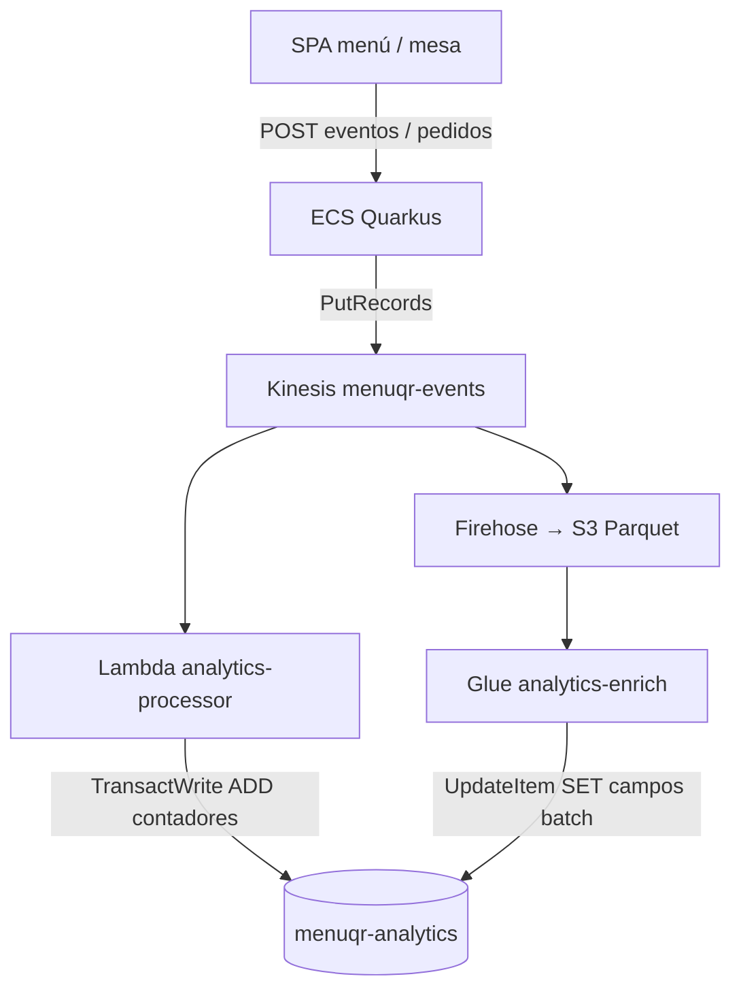

# Métricas en DynamoDB — Origen, estructura y lectura

Guía de cómo MenuQR guarda y consulta las métricas de analytics en la tabla `menuqr-analytics`. Complementa el diseño detallado en [analytics-dynamo-diseno.md](./analytics-dynamo-diseno.md).

---

## 1. Idea general

DynamoDB **no guarda eventos crudos**. Guarda **contadores pre-agregados** listos para el dashboard: un ítem por tenant + día, por tenant + hora, o por tenant + ítem de menú.

| Pregunta | Respuesta |
|----------|-----------|
| ¿Dónde nacen los eventos? | SPA menú / mesa → API ECS → Kinesis |
| ¿Quién escribe Dynamo en producción? | Lambda `analytics-processor` (casi en tiempo real) + Glue `analytics-enrich` (batch nocturno) |
| ¿Quién lee? | Backend Quarkus (`DynamoAnalyticsAggregateReadRepository`) vía `Query` por `PK`/`SK` |
| ¿Hay `Scan`? | **No** — en todo el repositorio no hay `Scan` sobre esta tabla |

Los **pedidos, ingresos, ticket, top vendidos, heatmap de pedidos, insights de menú** viven en **PostgreSQL (RDS)**. Dynamo cubre **tráfico y engagement** (vistas, carrito, sesiones, filtros, secciones).

---

## 2. Tabla física

| Propiedad | Valor |
|-----------|-------|
| Nombre | `menuqr-analytics` |
| Clave de partición | `PK` (String) |
| Clave de ordenación | `SK` (String) |
| Modo de facturación | `PAY_PER_REQUEST` |
| GSI | Ninguno |
| TTL | Solo en ítems `PROC#` (7 d) y `HOUR#` (90 d) |

Terraform: `terraform/dynamo_analytics.tf`.

Toda la data de un restaurante comparte la misma partición:

```
PK = TENANT#{uuid-del-restaurante}
```

El tipo de dato se distingue por el prefijo de `SK`.

---

## 3. Flujo de escritura (de dónde viene cada cosa)



### 3.1 Hot path (Lambda, segundos)

1. El usuario interactúa con el menú (vista, clic en ítem, sección, carrito).
2. El frontend llama `POST /api/menu/{slug}/events` o el backend publica al confirmar un pedido.
3. ECS escribe en Kinesis (`KinesisAnalyticsEventPublisher`).
4. La Lambda consume el stream y ejecuta `TransactWriteItems` en Dynamo.

**Código:** `analytics-processor/processor_lambda.py`

### 3.2 Batch path (Glue, diario ~03:00 UTC)

1. Firehose ya volcó los mismos eventos a S3 en Parquet.
2. Glue lee el día de ayer y el de hoy, deduplica por `eventId`.
3. Calcula métricas que **no** se pueden incrementar con un simple `+1` (sesiones únicas, top ítems, breakdowns).
4. Hace `UpdateItem` en el ítem `DAY#{fecha}` con `SET` — **no toca** `menuViews`, `itemViews`, etc.

**Código:** `glue-jobs/glue_analytics_enrich.py`

### 3.3 Dev local (sin Kinesis)

Con `ANALYTICS_KINESIS_ENABLED=false`, el backend escribe directo vía `DynamoAnalyticsAggregateRepository.java` (misma forma de ítems, misma idempotencia `PROC#`).

### 3.4 Demo / seed manual

`analytics-processor/scripts/seed_analytics_dynamo.py` hace `PutItem` con la misma forma de `DAY#`, `HOUR#` e `ITEM#` (incluye `batchCompletedAt` para simular Glue).

---

## 4. Tipos de ítem y estructura del record

Todos comparten `PK = TENANT#{tenantId}`.

### 4.1 `DAY#{yyyy-MM-dd}` — resumen diario

Ejemplo (valores ilustrativos):

```json
{
  "PK": "TENANT#a1b2c3d4-...",
  "SK": "DAY#2026-06-17",
  "menuViews": 142,
  "itemViews": 318,
  "sectionViews": 95,
  "cartAdds": 41,
  "uniqueMenuSessions": 98,
  "topItemIds": ["item-uuid-1", "item-uuid-2"],
  "filterBreakdown": {
    "VEGETARIAN": 28,
    "GLUTEN_FREE": 12
  },
  "sectionBreakdown": {
    "section-uuid-a": 40,
    "section-uuid-b": 55
  },
  "batchCompletedAt": "2026-06-17T03:15:00Z"
}
```

| Atributo | Quién lo escribe | Origen del dato |
|----------|------------------|-----------------|
| `menuViews` | Lambda (`ADD +1`) | Evento `MENU_VIEW` |
| `itemViews` | Lambda | Evento `ITEM_VIEW` |
| `sectionViews` | Lambda | Evento `SECTION_VIEW` |
| `cartAdds` | Lambda | Evento `CART_ITEM_ADDED` |
| `uniqueMenuSessions` | Glue (`SET`) | `COUNT(DISTINCT sessionId)` de `MENU_VIEW` en S3 |
| `topItemIds` | Glue | Top N `itemId` por cantidad de `ITEM_VIEW` en S3 |
| `filterBreakdown` | Glue | Conteo de `FILTER_APPLIED` / `FILTER_USED` por `metadata.filterTag` |
| `sectionBreakdown` | Glue | Conteo de `SECTION_VIEW` por `sectionId` |
| `batchCompletedAt` | Glue | Marca de que el job batch terminó ese día |

**Sin TTL** en `DAY#` (la historia diaria no expira automáticamente).

### 4.2 `HOUR#{yyyy-MM-dd}T{HH}` — bucket horario

Ejemplo:

```json
{
  "PK": "TENANT#a1b2c3d4-...",
  "SK": "HOUR#2026-06-17T14",
  "menuViews": 22,
  "itemViews": 51,
  "sectionViews": 14,
  "cartAdds": 7,
  "ttl": 1758000000
}
```

| Atributo | Escritura |
|----------|-----------|
| `menuViews`, `itemViews`, `sectionViews`, `cartAdds` | Lambda, mismos eventos que `DAY#` pero bucket por hora |
| `ttl` | Epoch + 90 días; Dynamo borra el ítem cuando expira |

**Uso en dashboard:** heatmap de vistas (7 días), panel realtime (últimos 60 min).

### 4.3 `ITEM#{itemId}` — acumulado por plato

Ejemplo:

```json
{
  "PK": "TENANT#a1b2c3d4-...",
  "SK": "ITEM#f47ac10b-58cc-4372-a567-0e02b2c3d479",
  "views": 1240,
  "lastViewedAt": "2026-06-17T14:32:10Z"
}
```

| Atributo | Escritura |
|----------|-----------|
| `views` | Lambda `ADD +1` en cada `ITEM_VIEW` |
| `lastViewedAt` | Lambda `SET` al timestamp del evento |

**Uso:** ranking “más vistos”, matriz mirado vs vendido (vistas desde Dynamo + ventas desde RDS).

### 4.4 `PROC#{eventId}` — ledger de idempotencia (no es métrica de UI)

Ejemplo:

```json
{
  "PK": "TENANT#a1b2c3d4-...",
  "SK": "PROC#evt-uuid-...",
  "processedAt": "2026-06-17T14:32:10Z",
  "ttl": 1758600000
}
```

- Se crea en la **misma transacción** que los contadores (`attribute_not_exists(SK)`).
- Si Kinesis reentrega el mismo evento, el `Put` en `PROC#` falla → la transacción entera se cancela → **no se duplican contadores**.
- **El dashboard no lee estos ítems.**

---

## 5. Eventos → Dynamo (qué entra y qué no)

| `eventType` | ¿Escribe agregados Dynamo? | Destino adicional |
|-------------|----------------------------|-------------------|
| `MENU_VIEW` | Sí → `menuViews` en `DAY#` + `HOUR#` | S3 vía Firehose |
| `ITEM_VIEW` | Sí → `itemViews` + `ITEM#views` | S3 |
| `SECTION_VIEW` | Sí → `sectionViews` | S3 (+ `sectionBreakdown` vía Glue) |
| `CART_ITEM_ADDED` | Sí → `cartAdds` | S3 |
| `FILTER_APPLIED` / `FILTER_USED` | No en hot path | S3 → Glue → `filterBreakdown` en `DAY#` |
| `CART_ITEM_REMOVED` | No | Solo S3 |
| `ORDER_SUBMITTED` | No | S3 + fila en RDS (`orders`) |
| `ORDER_STATUS_CHANGED` | No | S3 |

Publicación desde ECS: `RecordInteractionUseCase` (eventos SPA) y `PublishOrderAnalyticsUseCase` (pedidos → solo Kinesis, sin contador Dynamo).

---

## 6. Catálogo: métrica del dashboard → fuente

### 6.1 Solo Dynamo (o mayormente Dynamo)

| Métrica / panel | Campo Dynamo | Lectura |
|-----------------|--------------|---------|
| Vistas de menú hoy / ayer | `DAY#.menuViews` | `getDay` × 2 |
| Vistas de ítems (tendencias) | `DAY#.itemViews` | `queryDays` |
| Top ítems más vistos | `ITEM#.views` | `queryItems` + sort en API |
| Heatmap vistas (7 d) | `HOUR#` | `queryHours` |
| Realtime eventos (60 min) | `HOUR#` | `queryHours` + buckets de 5 min en memoria |
| Uso de filtros (tendencias) | `DAY#.filterBreakdown` | `queryDays` + merge en API |
| Engagement por sección | `DAY#.sectionBreakdown` | `queryDays` + nombres desde RDS/JPA |
| Top ítems del día (batch) | `DAY#.topItemIds` | `getDay` / `queryDays` (lista de IDs) |

### 6.2 Híbrido Dynamo + RDS

| Métrica | Numerador / fuente A | Denominador / fuente B |
|---------|----------------------|------------------------|
| Conversión menú → pedido | RDS: `COUNT(DISTINCT session_id)` en pedidos del día | Dynamo: `DAY#.uniqueMenuSessions` (Glue) |
| Estado conversión FINAL | — | Requiere `batchCompletedAt` del mismo día en `DAY#` |
| Matriz mirado vs vendido | Dynamo: `ITEM#.views` | RDS: cantidad vendida por ítem |
| Tendencias diarias | Dynamo: vistas + sesiones | RDS: pedidos e ingresos por día |

### 6.3 Solo RDS (no está en Dynamo)

| Métrica / panel | Repositorio |
|-----------------|-------------|
| Pedidos hoy / ayer | `OrderAnalyticsRepository` |
| Ingresos, ticket promedio | RDS |
| Top vendidos | RDS |
| Heatmap de pedidos | RDS |
| Mesas activas, hora pico de pedidos | RDS |
| Menu Insights (se piden juntos, ingeniería de menú, extras) | RDS |

---

## 7. Cómo se lee: siempre `Query`, nunca `Scan`

Toda la lectura pasa por `DynamoAnalyticsAggregateReadRepository.java`. **No hay `Scan`** en el backend ni en los jobs sobre esta tabla.

### 7.1 Un día concreto

`getDay(tenantId, date)` delega en `queryDays` con `from = to`:

```java
PK = :pk AND SK BETWEEN :from AND :to
// :from = "DAY#2026-06-17"
// :to   = "DAY#2026-06-17~"
```

El sufijo `~` en el límite superior garantiza orden lexicográfico correcto dentro del prefijo `DAY#`.

**Coste:** 1 ítem leído (o 0 si no existe). Complejidad O(1) respecto al tamaño de la tabla.

### 7.2 Rango de días (tendencias, hasta 90)

```java
PK = :pk AND SK BETWEEN "DAY#2026-06-01" AND "DAY#2026-06-30~"
```

**Coste:** O(número de días en el rango), típicamente 7–90 ítems. No depende del volumen histórico de eventos.

### 7.3 Rango de horas (heatmap, realtime)

```java
PK = :pk AND SK BETWEEN "HOUR#2026-06-10T12" AND "HOUR#2026-06-17T14~"
```

**Coste:** O(horas en el rango). Ejemplo: 7 días × ~24 h ≈ 168 ítems.

### 7.4 Todos los ítems de menú con vistas

```java
PK = :pk AND begins_with(SK, "ITEM#")
```

**Coste:** O(cantidad de ítems en carta con al menos un registro `ITEM#`), no O(eventos). Para un menú de ~50–150 platos es aceptable.

El top 10 se calcula **en la API** ordenando por `views` (`GetAnalyticsMenuUseCase`), no con un GSI ni un `Scan`.

### 7.5 Lo que no se hace (y por qué importa)

| Anti-patrón evitado | Esquema actual |
|---------------------|----------------|
| `Scan` de miles de `EVENT#timestamp` | No existen eventos crudos en Dynamo |
| Re-agregar en cada request | Contadores ya materializados en `DAY#` / `HOUR#` |
| GSI cross-tenant | Toda query fija `PK = TENANT#{id}` del JWT |

---

## 8. Mapeo endpoint API → operaciones Dynamo

| Endpoint | Use case | Operaciones Dynamo | Operaciones RDS |
|----------|----------|-------------------|-----------------|
| `GET /api/admin/analytics/summary` | `GetAnalyticsSummaryUseCase` | 2× `getDay` (hoy, ayer) | pedidos, ingresos, ticket, conversión |
| `GET /api/admin/analytics/menu` | `GetAnalyticsMenuUseCase` | 1–2× `queryItems` | `topSoldItems` |
| `GET /api/admin/analytics/operations` | `GetAnalyticsOperationsUseCase` | 1× `queryHours` (7 d) | heatmap pedidos, mesas, pico |
| `GET /api/admin/analytics/realtime` | `GetRealtimeAnalyticsUseCase` | 1× `queryHours` (60 min) | buckets de pedidos |
| `GET /api/admin/analytics/trends?days=N` | `GetAnalyticsTrendsUseCase` | 1× `queryDays` (N días) | `dailyStats` |
| `GET /api/admin/analytics/menu-insights` | `GetMenuInsightsUseCase` | — | SQL analítico |

---

## 9. Transacción de escritura (hot path)

Por cada evento elegible, la Lambda ejecuta **una** `TransactWriteItems` con hasta 4 operaciones:

```
1. Put    PROC#{eventId}          (condición: no existe)
2. Update DAY#{fecha}             (ADD contadores)
3. Update HOUR#{fecha+hora}       (ADD contadores + ttl)
4. Update ITEM#{itemId}?          (solo ITEM_VIEW)
```

Máximo **3 updates de contadores** por evento (presupuesto de diseño documentado en `analytics-rediseno.md`).

---

## 10. Zona horaria

Las claves `DAY#` y `HOUR#` usan la fecha/hora del **timestamp del evento** en UTC en la Lambda (`processor_lambda.py`) y en la JVM del backend en dev (`ZoneId.systemDefault()` en Fargate = UTC).

Las lecturas usan la misma zona (`DynamoAnalyticsAggregateReadRepository.ZONE`). **Importante:** al interpretar heatmaps, alinear seed y backend en la misma TZ (`--tz` en el script de seed).

---

## 11. Resumen para defensa

1. **Un solo write en la app** (Kinesis); Dynamo recibe agregados, no eventos sueltos.
2. **Dos velocidades:** Lambda incrementa contadores al instante; Glue materializa sesiones únicas y breakdowns desde S3.
3. **Modelo de claves:** `PK = tenant`, `SK = tipo + granularidad` → todas las lecturas son `Query` acotadas.
4. **Sin `Scan`:** el costo de leer 30 días es 30 ítems `DAY#`, no miles de eventos.
5. **Pedidos e ingresos en RDS; tráfico en Dynamo** — el dashboard une ambos en los use cases.

---

## 12. Referencias en código

| Tema | Archivo |
|------|---------|
| Tabla Terraform | `terraform/dynamo_analytics.tf` |
| Escritura producción | `analytics-processor/processor_lambda.py` |
| Escritura dev | `backend/.../DynamoAnalyticsAggregateRepository.java` |
| Lectura | `backend/.../DynamoAnalyticsAggregateReadRepository.java` |
| Batch enrich | `glue-jobs/glue_analytics_enrich.py` |
| Endpoints | `backend/.../interfaces/rest/admin/AnalyticsResource.java` |
| Seed demo | `analytics-processor/scripts/seed_analytics_dynamo.py` |
| Diseño extendido | `docs/analytics-dynamo-diseno.md` |
