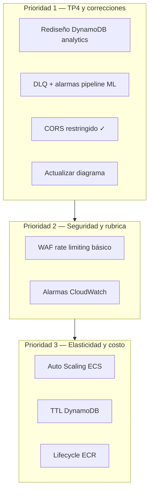

# MenuQR — Propuestas de mejora

Propuestas priorizadas para la entrega TP4 y evolución de la arquitectura, considerando:

- Rubrica y consigna de [ConsignaTP4.txt](./ConsignaTP4.txt)
- Feedback de [Corecciones.txt](./Corecciones.txt)
- Restricciones de [ListadoServiciosLearnerLab.txt](./ListadoServiciosLearnerLab.txt)
- Relevamiento de arquitectura (junio 2026)

**Leyenda de viabilidad en Learner Lab:**

| Etiqueta | Significado |
|----------|-------------|
| ✅ Lab | Servicio disponible y compatible con LabRole |
| ⚠️ Lab | Viable pero impacto en presupuesto o permisos limitados |
| 🔒 Lab | Restricción relevante del lab (LabRole, sin dominio, etc.) |
| 🏭 Prod | Recomendable solo fuera del contexto académico |

---

## Priorización sugerida



---

## A. Analytics y DynamoDB *(feedback del corrector — Prioridad 1)*

### Problema actual

El esquema `PK=TENANT#… / SK=EVENT#timestamp#id` funciona para escritura, pero las consultas del dashboard:

1. Traen **todos los eventos de 30 días** por tenant.
2. Filtran por `eventType` **en memoria** (`findByTenantTypeAndPeriod`).
3. Recalculan agregaciones (heatmap, rankings, filtros) en cada request.

Con volumen real esto escala mal en latencia, costo de RCU y tamaño de respuesta.

### Propuesta: modelo híbrido eventos + agregados

**A1. Mantener tabla de eventos crudos (opcionalmente con TTL)**

```
PK = TENANT#{tenantId}
SK = EVENT#{isoTimestamp}#{eventId}
TTL = expiresAt  (ej. 90 días)
```

**A2. Tabla o ítems de agregados precomputados**

Opción recomendada para el lab (sin servicios extra):

| Entidad | PK | SK | Uso |
|---------|----|----|-----|
| Conteo diario | `TENANT#{id}` | `DAY#{yyyy-MM-dd}` | Gráfico de vistas diarias |
| Conteo horario | `TENANT#{id}` | `HOUR#{yyyy-MM-dd}T{HH}` | Heatmap y tiempo real |
| Ranking ítems | `TENANT#{id}` | `ITEM#{itemId}` | Top ítems + trending |
| Filtros | `TENANT#{id}` | `FILTER#{tag}` | Gráfico de filtros |
| Secciones | `TENANT#{id}` | `SECTION#{sectionId}` | Engagement por sección |

**A3. Actualización de agregados**

- **Opción A (simple):** incrementar contadores en el mismo `PutItem` del evento (transacción DynamoDB o update atómico).
- **Opción B (desacoplada):** publicar evento en **SNS → Lambda agregador** (segunda cola/tópico; refuerza rubrica SQS/SNS).
- **Opción C (batch):** Lambda nocturna post-ML que consolida el día anterior (complementa el worker existente).

**A4. GSI para consultas analíticas** ✅ Lab

Si se mantiene solo la tabla de eventos:

```
GSI1: eventType-index
  PK = TENANT#{tenantId}#TYPE#{eventType}
  SK = EVENT#{timestamp}
```

Permite queries directas por tipo sin scan ni filtro en app.

### Impacto en el dashboard

| Métrica actual | Fuente propuesta |
|----------------|------------------|
| Vistas 30d / hoy | Suma de ítems `DAY#*` |
| Sesiones únicas | Mantener eventos o HyperLogLog en ítem `STATS#sessions` |
| Heatmap | Ítems `HOUR#*` |
| Top ítems | Query sobre `ITEM#*` ordenado por contador |
| Filtros / secciones | Ítems `FILTER#*` / `SECTION#*` |
| Tiempo real | Query últimas N horas en `HOUR#*` |

### Justificación para la defensa oral (40% teoría)

- Explicar **access patterns** de DynamoDB: diseño invertido según consultas, no según escritura.
- Mencionar trade-off **consistencia eventual** en agregados vs latencia de dashboard.
- Conectar con TP1: “analítica útil para PyMEs” requiere respuestas rápidas, no re-procesar millones de eventos.

---

## B. Seguridad y Cognito *(rubrica 20% — Prioridad 2)*

### B0. HTTP sin TLS — fuera de alcance en Learner Lab ❌ No aplicar

**Acordado:** no implementar HTTPS en esta entrega.

| Bloqueo en el lab | Efecto |
|-------------------|--------|
| Route 53: no registrar dominios | Sin hostname propio para validar ACM |
| ALB usa `*.elb.amazonaws.com` | No se puede asociar certificado ACM público |
| S3 website hosting | Solo expone HTTP |
| CloudFront no listado en servicios del lab | Sin vía habitual de HTTPS con dominio `*.cloudfront.net` |

**En la defensa:** explicar la limitación del entorno y cómo se mitigaría en producción (CloudFront + ACM, o ALB 443 con dominio). Cognito y RDS Proxy **sí** usan TLS en sus propios canales (JWKS, conexión a BD vía proxy).

### B0b. IAM / LabRole — fuera de alcance ❌ No aplicar

**Acordado:** no intentar roles IAM propios ni least privilege granular en esta entrega.

| Restricción del lab | Efecto |
|---------------------|--------|
| IAM: no crear roles custom | Solo `LabRole` (+ service-linked roles puntuales) |
| ECS / Lambda / RDS Proxy | Documentación y consola del lab piden explícitamente `LabRole` |
| Mismo rol en todos los servicios | Permisos amplios compartidos; no es una decisión de diseño del equipo |

**En la defensa:** reconocer el trade-off y mencionar mitigaciones reales del repo: subnets privadas, SGs, buckets privados, RDS sin acceso público, Cognito en endpoints admin.

### B1. Restringir CORS ✅ Hecho

Implementado: `QUARKUS_HTTP_CORS_ORIGINS` en ECS con las URLs de admin y menú (`local.cors_allowed_origins` en Terraform); dev local mantiene default `localhost:5173,5174` en `application.properties`.

### B2. WAF con rate limiting ⚠️ Lab

AWS WAF está disponible en el lab. Reglas sugeridas sobre el ALB:

- Rate-based rule en `POST /api/menu/*/events` (anti-spam de analytics).
- Bloqueo de patrones conocidos (SQLi, XSS básico).

**Presupuesto:** WAF tiene costo por regla + requests; usar 1–2 reglas simples.

### B3. Endurecer endpoint público de eventos ✅ Lab

Alternativas graduales:

1. Rate limit en WAF (arriba).
2. Token anónimo firmado (HMAC) emitido al cargar el menú, validado al postear eventos.
3. Throttling por `sessionId` + `slug` en backend (sin infra extra).

### B4. MFA en Cognito ⚠️ Lab

Habilitar MFA opcional (TOTP) en el User Pool admin. Refuerza la narrativa de seguridad multi-tenant.

---

## C. Pipeline ML y elasticidad *(rubrica SQS 10% — Prioridad 1)*

### C1. Dead Letter Queue (DLQ) ✅ Lab

```hcl
# Propuesta terraform/lambdas.tf
resource "aws_sqs_queue" "ml-training-dlq" { ... }

resource "aws_sqs_queue" "ml-training" {
  redrive_policy = jsonencode({
    deadLetterTargetArn = aws_sqs_queue.ml-training-dlq.arn
    maxReceiveCount     = 3
  })
}
```

### C2. Alarmas CloudWatch ✅ Lab

| Alarma | Condición |
|--------|-----------|
| DLQ > 0 mensajes | Fallo persistente del worker |
| Lambda worker errors | `Errors > 0` en 5 min |
| SQS ApproximateAgeOfOldestMessage | Jobs estancados |
| ALB TargetResponseTime / 5xx | Salud del backend |
| RDS CPU / FreeStorageSpace | Capacidad DB |

### C3. Visibility timeout

Actual: 360s con Lambda timeout 300s — correcto. Documentar la relación en la defensa.

### C4. SNS para notificación de fallos (opcional) ✅ Lab

SNS → email cuando DLQ recibe mensajes. Refuerza criterio “SQS **o** SNS” con ambos servicios.

---

## D. Elasticidad y disponibilidad *(consigna TP4 — Prioridad 3)*

### D1. Application Auto Scaling en ECS ✅ Lab

- Target tracking por CPU (ej. 70%) sobre el servicio Fargate.
- Min: 2, Max: 4 (respetar presupuesto del lab).
- **Narrativa TP1:** picos de almuerzo/cena justifican auto scaling.

### D2. Circuit breaker en deploy ECS ✅ Lab

```hcl
deployment_circuit_breaker {
  enable   = true
  rollback = true
}
```

### D3. NAT Gateway ⚠️ Lab — costo

- **Actual:** single NAT (~USD 32/mes + tráfico; ver estimación del lab).
- **Mejora HA:** NAT por AZ — duplica costo.
- **Alternativa económica:** más VPC endpoints (`logs`, `monitoring`) para reducir tráfico por NAT.

Recomendación lab: mantener single NAT y justificar trade-off costo vs HA.

---

## E. Frontend y contenido estático

### E1. CloudFront — fuera de alcance ❌ No aplicar

CloudFront no está en el [listado de servicios del Learner Lab](./ListadoServiciosLearnerLab.txt). Además, el motivo principal para incluirlo era HTTPS en frontends, que ya descartamos para esta entrega.

### E2. Imágenes vía presigned URLs ✅ Hecho

Bucket privado con policy `DenyInsecureTransport`; API devuelve URLs prefirmadas GET (1 h); proxy `/api/media` eliminado.

---

## F. Observabilidad y operaciones

### F1. Log groups con retención ✅ Lab

Definir `aws_cloudwatch_log_group` para ECS y Lambdas (retención 7–14 días para ahorrar).

### F2. Dashboard CloudWatch ✅ Lab

Panel único: ALB, ECS, RDS, SQS, Lambdas. Útil para demo en vivo (rubrica “funcionamiento en tiempo real”).

### F3. X-Ray (opcional) ✅ Lab

Trazas en API Quarkus para mostrar latencia DynamoDB + RDS en la defensa.

---

## G. Datos y costos

### G1. TTL en DynamoDB ✅ Lab

- Eventos crudos: 90 días.
- Agregados diarios: 1–2 años (tamaño mínimo).

Controla costo y cumple con analytics reciente de TP1.

### G2. Lifecycle policy en ECR ✅ Lab

Retener últimas N imágenes; evitar acumulación con tag `latest`.

### G3. Point-in-time recovery DynamoDB ⚠️ Lab

Habilitar PITR si el presupuesto lo permite; bajo costo relativo vs RDS.

---

## H. Diagrama de arquitectura *(rubrica 10%)*

Actualizar `Architecture.png` si se implementa alguna propuesta:

| Elemento | Acción en diagrama |
|----------|-------------------|
| DLQ | Añadir cola fallida junto a SQS ML |
| Agregados DynamoDB | Segunda tabla o nota en tabla existente |
| WAF | Entre Internet e IGW/ALB |
| Auto Scaling | Flecha ECS ↔ métricas |
| CloudWatch | Icono de alarmas/dashboard |
| SNS (si aplica) | Desde DLQ o alarmas |

---

## Matriz de priorización

| ID | Propuesta | Impacto TP4 | Esfuerzo | Lab | Prioridad |
|----|-----------|-------------|----------|-----|-----------|
| A1–A4 | Rediseño DynamoDB analytics | Alto (corrección + funcionalidad) | Medio | ✅ | **P1** |
| C1 | DLQ cola ML | Medio (SQS + operaciones) | Bajo | ✅ | **P1** |
| H | Actualizar diagrama | Alto (10% rubrica) | Bajo | ✅ | **P1** |
| C2 | Alarmas CloudWatch | Medio (demo en vivo) | Medio | ✅ | **P2** |
| B2 | WAF rate limit | Medio (seguridad) | Medio | ⚠️ | **P2** |
| D1 | Auto Scaling ECS | Alto (elasticidad consigna) | Medio | ✅ | **P2** |
| G1 | TTL DynamoDB | Medio (costo + diseño) | Bajo | ✅ | **P2** |
| D3 | NAT por AZ | Bajo en lab | Alto costo | ⚠️ | **P3** |
| B4 | MFA Cognito | Bajo-Medio | Bajo | ⚠️ | **P3** |

---

## Plan de trabajo sugerido (iteraciones)

### Iteración 1 — Cierre de brechas de corrección (1–2 días)

1. Diseñar access patterns DynamoDB documentados.
2. Implementar agregados o GSI mínima para dashboard.
3. Agregar DLQ + alarma básica.
4. Actualizar diagrama y este documento.

### Iteración 2 — Refuerzo rubrica TP4 (1–2 días)

1. Auto Scaling ECS (demostrable en consola).
2. Alarmas CloudWatch + dashboard.
3. WAF/CORS como mitigaciones de seguridad en un entorno HTTP (HTTPS documentado solo como evolución post-lab).

### Iteración 3 — Pulido (opcional)

1. SNS en fallos ML.
2. TTL y lifecycle policies.

---

## Qué decir en la defensa oral

1. **Por qué DynamoDB para eventos y RDS para transaccional:** write-heavy, consultas por tenant, desacople del pipeline ML.
2. **Por qué SQS entre orquestador y worker:** desacople, reintentos, batch con fallos parciales, elasticidad del entrenamiento.
3. **Por qué Cognito:** PyMEs sin IdP propio; tokens estándar; integración SPA.
4. **Trade-offs del lab:** `LabRole` obligatorio (sin IAM custom), HTTP sin TLS (sin dominio ni CloudFront), NAT único — restricciones del entorno AWS Academy, no omisiones del diseño.
5. **Roadmap analytics:** de eventos crudos a agregados precomputados (propuesta A).

---

## Referencias

- Estado actual: [cambios-hechos.md](./cambios-hechos.md)
- Propuesta TP1: [propuestaTP1.txt](./propuestaTP1.txt)
- Consigna TP4: [ConsignaTP4.txt](./ConsignaTP4.txt)
- Correcciones: [Corecciones.txt](./Corecciones.txt)
- Servicios Learner Lab: [ListadoServiciosLearnerLab.txt](./ListadoServiciosLearnerLab.txt)
